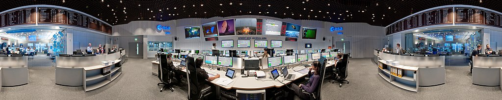

Примене „интернета ствари“
==========================

„Уређаји интернета ствари“ примењују се у најразличитијим областима људског деловања. Овде ћемо описати 
само неке од најзначајнијих примена.

Примене у свакодневном животу
-----------------------------

**Паметни аутомобили**
Паметни аутомобили садрже уређаје помоћу којих могу да се повежу на интернет и комуницирају са окружењем 
и другим аутомобилима. Овакво повезивање омогућава различите примене. Ево неких ствари које паметан 
аутомобил може да ради:

- на захтев извршава дијагностичку проверу и пружа детаљан извештај кориснику, подсећа власника на датум 
  редовног сервисирања; помаже власнику у поправци и одржавању возила пружањем одговарајућих смерница;
- помаже у одређивању најкраћег, односно најмање оптерећеног пута, или лоцирању празног паркинг места на 
  одговарајуће опремљеном паркингу;
- јавља локацију возила, начин потрошње горива (сигнализира неравномерну потрошњу, посебно истакање горива), 
  број сати проведених у вожњи (сигнализира вожњу без одговарајућег одмора) и слично;
- веома брзом разменом информација са другим аутомобилима, паметан аутомобил може да помогне при избегавању 
  или ублажавању последица судара.

**Видео-надзор**
Видео надзором могу да се обезбеђују пословни простори, стамбене зграде, јавне површине (улице, тргови), 
приватна имања и друго. Надзорне камере могу да имају своју мрежну опрему и своју IP адресу, те им тако за 
повезивање на интернет није потребан рачунар, већ могу да шаљу сигнал директно центру за безбедност. 
Подаци могу да се користе за надзор у реалном времену, а обично се и чувају током извесног периода, тако 
да недавни снимци могу да се добију на захтев.

Неке камере које снимају јавне површине, шаљу сигнал веб-серверу, тако да посећивањем одговарајуће веб-адресе може уживо да се прати видео снимак који бележи камера. На пример, 
`овде <https://www.infokop.net/info/ski-kamere-2.html>`_ може да се прати видео са неколико камера на 
Копаонику, а постоје слични видео записи уживо из свих већих градова у Србији.

**Биометријски сигурносни системи**
Многе безбедносне агенције користе биометријске системе за бележење редовног (свакодневног) присуства, 
дозволу приступа само овлашћеном особљу и друге повезане услуге. Биометријска технологија користи 
препознавање отиска прста, гласа, очију и лица. Поузданост безбедносних система заснованих на „интернету“ 
ствари већа је од ручног или аутоматизованог приступа. Уређаји који се користе у биометријским сигурносним 
системима међусобно су повезани и имају могућност да након сваке употребе шаљу податке на рачунар. Ови 
скенирани подаци се чувају за будућу употребу, а информације могу да се преузму на захтев.

**Кућна аутоматизација**
Кућна аутоматизација је један од најпопуларнијих примера „интернета ствари“. У такозваним паметним кућама, 
потрошачки електронски уређаји као што су светла, вентилатори, грејање, клима-уређаји, електронско 
закључавање брава итд. могу да се повежу на интернет, што омогућава кориснику да управља овим уређајима 
са удаљености. Могуће је и да уређајима управља одговарајући софтвер, на пример тако да подешава 
грејање према томе да ли је дан или ноћ, да ли су станари у кући или нису, према спољној температури 
итд. Тренутно се ова примена „интернета ствари“ не користи у великој мери јер је цена инсталације превисока, 
међутим, у будућности се очекује значајан раст кућне аутоматизације.

.. коментар

    **Тржни центри**
    Једна од свакодневних примена интернета ствари су системи наплате у тржним центрима. У многим тржним 
    центрима, корисник може сам да скенира бар кодове на производима које купује. Ручни скенер шаље 
    добијене податке главном рачунару. Рачунар је даље повезан са машином за наплату, која након обраде 
    предаје рачун купцу. Сви ови уређаји су повезани уз помоћ интернета ствари.

.. figure:: ../../_images/ruka.jpg
    :width: 300px
    :align: center
        
    Lgate74, CC BY 3.0 
        
    <https://creativecommons.org/licenses/by/3.0>, via Wikimedia Commons

Примене у индустрији
--------------------

Данас је већ потпуно јасно да је спровођење такозване „дигиталне трансформације“ од суштинског значаја за 
опстанак и развој великих производних и других компанија. У оквиру дигиталне трансформације веома важну 
улогу игра и „интернет ствари“. Индустрија опремљена „интернетом ствари“ је у предности, јер подиже брзину 
производње и одржава уједначен квалитет производа током целе производње. Такође помаже да радно место 
буде безбедније, а рад ефикаснији. 

Због значаја примене „интернета ствари“ у индустрији, описаћемо ове примене нешто детаљније.

**Аутоматско и даљинско управљање опремом и надзор:** 
Једна од главних примена индустријског „интернета ствари“ (IIoT) се односи на аутоматизовано управљање 
опремом, омогућавајући централизованом систему да контролише и надгледа све процесе компаније. Даљинско 
управљање дигиталним машинама може да се примени и на више постројења, која се налазе на различитим 
географским локацијама. На овај начин, компаније добијају до сада невиђену могућност да надгледају 
напредак у својој производњи у реалном времену. Руководиоци тако имају детаљан и веома брз увид у 
стање у свим фабричким погонима, па у случају потребе могу брзо и прецизно да реагују. Одлуке донете 
на основу детаљних и правовремених информација обично су квалитетније и делотворније него оне засноване 
на теоријским предвиђањима, тако да се цео процес производње побољшава. 

        
    ESA/J. Mai, CC BY-SA IGO 3.0

    <https://creativecommons.org/licenses/by-sa/3.0/igo/deed.en>, via Wikimedia Commons

**Предиктивно одржавање:**
Предиктивно одржавање подразумева откривање потребе за одржавањем машине пре него што настане проблем 
због којег би производња морала да се хитно заустави. Стога је то један од разлога да се спроведе 
прикупљање, анализа и управљање подацима. 

Систем откривања потребе за одржавањем је једна од најефикаснијих индустријских примена „интернета 
ствари“. Овај систем ради преко сензора који, једном инсталирани на машинама и оперативним платформама, 
могу да шаљу упозорења када се појаве одређени фактори ризика. На пример, сензори који надгледају 
роботе или машине шаљу податке на платформе, које анализирају примљене податке у реалном времену и 
примењују напредне алгоритме који могу да издају упозорења у вези са високим температурама или 
вибрацијама које прелазе нормалне параметре.

На сличан начин може да се прати стање градске инфраструктуре (напрезање на мостовима, проток, ниво 
воде и притисак у канализацији), авиона, модерних возова итд. На основу информација добијених са 
сензора може да се пошаље правовремено упозорење и квар отклони док је сасвим мали и не производи 
последице. Тиме се спречава већа штета, која би настала због каснијег откривања (или, у најгорем 
случају, неоткривања) проблема. Оваква решења се већ користе у неким превозним компанијама, односно 
„паметним градовима“. 

**Бржа имплементација побољшања:**

„Интернет ствари“ у индустрији генерише вредне информације, тако да они који су задужени за унапређење 
процеса у индустријском пословном моделу (инжењери процеса, квалитета или производње) могу да приступе 
подацима и анализирају их брже и аутоматски, и даљински да изврше неопходна прилагођавања процеса. Ово 
такође повећава брзину у којој се промене и побољшања примењују у оперативној интелигенцији и пословној 
интелигенцији.

Прикупљање великих количина података носи са собом велике изазове због брзине којом подаци пристижу 
и количине потребне меморије за складиштење, а и сама анализа не може да се служи истим средствима 
као код умерених количина података. О начинима решавања тих проблема говори се у одељку  
`Обрада великих количина података <../4_big_data/big_data.html>`_.

**Тачне залихе:**
Да би индустријски процеси несметано текли, веома је важно да у сваком тренутку постоји довољна 
количина залиха компоненти и сировина које се користе у производњи, као и да не дође до нагомилавања 
количина готових производа. Употребом „интернета ствари“ могуће је аутоматизовано праћење инвентара у 
складиштима (паметне полице), потврђивање да се планови допремања и отпремања поштују и издавање 
упозорења у случају одступања. На овај начин спречавају се застоји у производњи који би могли да 
настану услед недостатка производних материјала, односно немогућности складиштења производа. 

**Контрола квалитета:**
Још једна важна примена „интернета ствари“ у индустрији је могућност праћења квалитета производа у било 
којој фази: од сировина које се користе у процесу, преко начина на који се транспортују (преко апликација 
за паметно праћење), до реакције крајњег купца када производ стигне до њега. Ове информације су од 
виталног значаја за проучавање ефикасности компаније и примену неопходних промена у случају откривања 
недостатака, ради оптимизације процеса и правовременог откривања проблема у производном ланцу. Ово 
је посебно важно у индустријама осетљивим на квалитет, као што су производња хране и лекова.

**Оптимизација ланца снабдевања:**
Информације о транзиту у реалном времену омогућавају да се открију различите скривене могућности за 
побољшавање транспорта, прецизним адресирањем проблема који ометају процес транспорта, чинећи га 
неефикасним или неисплативим.

**Побољшање безбедности постројења:**
Уређаји „интернета ствари“ могу да генеришу податке у реалном времену о ситуацији у фабрици. Праћењем 
оштећења опреме, квалитета ваздуха у постројењу и учесталости болести у предузећу, између осталих 
показатеља, могуће је избећи ризичне сценарије који представљају опасност по раднике. Ово не само 
да повећава безбедност у објекту, већ и продуктивност и мотивацију запослених. Поред тога, минимизирају 
се економски трошкови и трошкови репутације који су резултат лошег управљања безбедношћу компаније.

Примене у медицини
------------------

**Носиви монитори здравственог стања:**
Постоје различити носиви уређаји засновани на „интернету ствари“, који служе за надгледање здравственог стања. 
Дизајнирани су да прате величине као што су крвни притисак, пулс, број корака, итд. Ови подаци се снимају и 
могу се самостално анализирати, или послати лекарима на детаљну анализу. Осим извођења ових основних операција, 
ови уређаји могу да дигну узбуну и пошаљу упозорење у хитним случајевима као што су напади астме, срчани или 
епилептични напади итд. Неки од ових уређаја се носе на зглобу шаке, неки се облаче, а неки могу и да се уграде 
хируршким путем.

Примене у ратарству
-------------------

Недостатак влаге у земљишту доводи до разних проблема у ратарству, као што су полегање усева, ерозија земљишта, 
суша, итд. Систем за наводњавање заснован на „интернету ствари“ користи бројне сензоре за праћење садржаја влаге 
у земљишту. Ако ниво влаге падне испод одређеног опсега, аутоматски се укључује пумпа за наводњавање. 

„Интернет ствари“ такође помаже пољопривредницима да испитају састав земљишта. Пре новог циклуса узгоја усева, 
ратар треба да поврати хранљиве материје у тлу. Различити уређаји помоћу сензора испитују састав земљишта, а 
затим шаљу податке преко „интернета на рачунар, где одговарајући програм помаже ратару да одабере најбоље усеве 
за обнављање хранљивих материја, саветује у вези са потребним ђубривом и другим пољопривредним потребама.

Ако вас интересује примена „интернета ствари“ и сродних технологија у ратарству, препоручујемо вам ову 
`ТВ емисију <https://www.youtube.com/watch?v=va5SfEIDuwc>`_, из које ћете стећи известан увид у могућности 
које су доступне и у нашој земљи.
