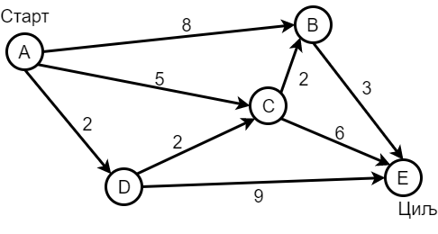
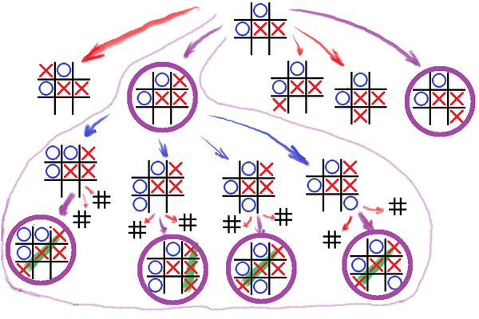

Видови вештачке интелигенције
=============================

Решавање проблема засновано на претрази
---------------------------------------

Многи проблеми могу да се моделирају помоћу графова или дрвета. Такав је, на пример, проблем проналажења 
пута од једног до другог датог града. При томе може да се тражи пут који је по неком критеријуму 
оптималан (нпр. најкраћи пут, пут који захтева најмање времена, или најмање горива, или пут са најмање 
буке и слично). У овом проблему чворови су градови, а гране путеви између градова. При томе су гранама 
додељене тежине, које могу да представљају дужине путева, потребно време или неку другу величину коју 
треба минимизирати на укупном путу.

    
    Проблем налажења пута са најмањим збиром тежина грана

.. fillintheblank:: ai_najkraci_put

    Који је најмањи збир тежина на путу од стартног до циљног чвора? 
   
    Одговор (уписати цифрама): |blank|

    - :^\s*9\s*$: Тачно.
      :x: Покушај поново.

Још један пример употребе графова су потезне игре за једног или више играча. У овом случају, чворови 
графа представљају стања, односно позиције у игри, а гране представљају могуће потезе. Задатак може да 
буде да се пронађе победнички потез, или низ потеза. У случају сложеније игре могу да се поставе и 
додатни захтеви, нпр. да се до победе дође у најмањем броју потеза.

    
    Проблем налажења победничких потеза (означених љубичасто)

Наравно, ово је само пар сликовитих примера, док је број стварних проблема који могу да се представе 
на овај начин заиста огроман.

У проблемима овог типа решење обично представља одређени избор из датог мноштва могућности, који 
је по установљеном критеријуму оптималан. Један очигледан начин да се дође до решења је да се 
помоћу рачунара испробају све могућности, односно да се дати простор могућности систематично претражи. 
Примери са слика су довољно мали да можемо да их решимо и у мислима, а при томе не морамо да бринемо 
о томе да ли је наш поступак могао да буде и рационалнији (ефикаснији). Са повећањем примера повећава 
се и значај ефикасности у претрази графа.

У раној фази развоја вештачке интелигенције развијени су и многи алгоритми претраге графова, који су 
данас део стандардног градива на студијама рачунарских наука. Систематичне претраге графова и данас 
представљају важан начин решавања проблема, мада су брзо откривена и нека ограничења овог приступа. 
Испоставило се да чак ни најефикаснији алгоритми комплетне претраге нису довољни за решавање већих 
проблема, због такозване **комбинаторне експлозије**. На пример, у познатом „проблему трговачког путника“ 
потребно је одредити најкраћу путању којом се сваки од :math:`N` датих градова обилази по једанпут. 
Број могућих путања једнак је броју могућих редоследа у набрајању градова, односно броју пермутација 
низа од :math:`N` елемената, а то је :math:`N!` (ен факторијел). Тако, за :math:`N=5` градова имамо :math:`N!=120` 
могућих редоследа обилажења, док већ за :math:`N=20` имамо :math:`N!=2~432~902~008~176~640~000` 
могућих редоследа. Број могућих обилазака се повећава огромном брзином, па са умереним повећањем 
броја градова (нпр. неколико десетина или пар стотина), број путања постаје толико велики да их је 
практично немогуће све испитати. Да би се овај проблем превазишао или донекле ублажио, потребно је 
да се у програму искористе неке додатне информације о проблему, што зависи од самог проблема и често 
није једноставно.

Док се не напомене другачије, у проблемима претраге се подразумева само то да су познати „потези“ који 
из текућег стања (чвора у графу) воде у непосредно доступна, суседна стања (суседне чворове), као и да 
се може испитати да ли је неко стање завршно (циљно). Уколико нема додатног знања о природи проблема, 
које може да се искористи за усмеравање претраге ка неком од циљних стања, таква претрага се назива 
**неинформисана претрага** (енгл. uninformed search). 
Насупрот томе, **информисана, или хеуристичка претрага** (енгл. informed search) има на располагању 
и додатна знања, која су специфична и различита за сваки конкретан проблем. Хеуристика (од грчког 
εὑρίσκω; проналазим) је метод за који не постоји гаранција да је оптималан, или да уопште доводи до 
решења, али се искуствено, тј. практично показао као користан. На пример, у шаху не можемо да 
будемо сигурни да је узимање противничке фигуре добар потез, али често јесте. Зато је добра хеуристика 
да се такви потези међу првима детаљније размотре, нарочито за фигуре веће вредности. Људи стално 
користе хеуристике и у обичном животу. На пример, вероватно нећете пити воду ако приметите да има 
одређену боју или мирис, иако је можда безопасна. 

Ако бисмо неинформисану претрагу упоредили са тражењем излаза из непрегледног лавиринта, информисана 
претрага би могла да се замисли као тражење излаза чије GPS координате су познате, при чему имамо и 
компас и уређај који нам јавља наше тренутне координате, али немамо навигацију до циља. Наша хеуристичка 
оцена квалитета тренутног положаја може да се заснива на разлици координата тренутне и циљне позиције. 
Овде нема гаранције да нас смањивање те разлике доводи ближе циљу у смислу пута који је потребно прећи 
кроз ходнике лавиринта, али је много боље од лутања наслепо. У комбинацији са другим техникама, 
хеуристика заснована на координатама (нпр. кретање најпре дуж ходника којим се највише смањује разлика 
координата) често нам (али не увек) помаже да знатно брже нађемо излаз.

.. learnmorenote:: Још мало о хеуристикама 

    Употреба хеуристика је често довољна за брже достизање циља, или приближног (субоптималног) решења, 
    када налажење најбољег решења због величине простора претраге није практично изводљиво систематичном, 
    неинформисаном претрагом. У хеуристичким претрагама се често руководимо тзв. образованим нагађањем 
    (енгл. educated guess) или неким опште прихваћеним принципом (енгл. rule of thumb). Чест је случај 
    и да се формулише и користи нека функција која чворовима у претраживаном графу, тј. стањима у 
    решаваном проблему додељује нумеричке вредности. Таква функција се назива **функција оцене стања** 
    или **функција оцене позиције** и она се користи за навођење претраге ка циљном стању. Приликом 
    решавања разних проблема, уочене су неке заједничке особине различитих хеуристичких приступа, па 
    је из тих истраживања настала одређена теорија и развијени су општи хеуристички алгоритми који се 
    ослањају на функцију оцене стања која има потребне особине. Типично, хеуристички алгоритми настоје 
    да са текућег стања пређу на најбоље суседно стање, тј. суседно стање у коме функција оцене има највећу 
    вредност. Такви су, на пример, похлепни алгоритми (енгл. `greedy algorithm <https://en.wikipedia.org/wiki/Greedy_algorithm>`_), 
    алгоритми пењања уз брдо (енгл. `hill climbing <https://en.wikipedia.org/wiki/Hill_climbing>`_), 
    алгоритми градијентног успона или спуста (енгл. `gradient ascent/descent <https://en.wikipedia.org/wiki/Gradient_descent>`_) 
    и други сродни поступци. Типичан проблем ових једноставних похлепних приступа је заглављивање у 
    локалном оптимуму који није циљно стање. Зато се похлепан приступ често комбинује са другим поступцима. 
    На пример, у неким проблемима је могуће да се започне похлепно напредовање са више места у простору 
    претраге, или да се запамте нека перспективна стања која нису први избор у датом тренутку, да би се 
    претрага касније вратила на тај део простора. Примери такве, унапређене претраге су алгоритми *најпре најбољи* 
    (енгл. `best-first search <https://en.wikipedia.org/wiki/Best-first_search>`_), A* (а звезда, енгл. 
    `a star <https://en.wikipedia.org/wiki/A*_search_algorithm>`_) и претрага снопа (енгл. 
    `beam search <https://en.wikipedia.org/wiki/Beam_search>`_).

Поменимо да се поред неинформисане и информисане претраге често користе и разни облици случајне и 
непотпуне претраге. Познати примери су разни еволуциони алгоритми (нпр. генетски алгоритми, симулирано 
каљење, мравље колоније и други), и Монте Карло претраге у којима алгоритам може да научи да игра 
логичку игру тако што одигра огроман број партија сâм против себе и памти потезе који су доводили до 
успеха.

Аутоматско резоновање
---------------------

Рани истраживачи ВИ су развили алгоритме који су имитирали размишљање корак по корак, које људи 
користе када решавају логичке проблеме, односно када дедуктивно закључују. Ови алгоритми се увелико 
ослањају на радове раније помињаних математичара, логичара и филозофа (у делу о значају формалне 
логике). Једноставан пример формалног 
закључивања је да из претпоставки :math:`\neg P \implies A, P \implies B` може да се изведе (дедукује) 
закључак :math:`A \lor B`. Ово није тешко потврдити знајући да :math:`P` мора да буде или тачно или 
нетачно. Рачунарски програми који су у стању да поред осталог изводе овакве закључке и комбинују их, 
успешно су употребљени у разним областима, као што су:

- доказивање математичких теорема;
- доказивање да одређени рачунарски програми раде управо оно што се од њих очекује, тј. да немају 
  логичких грешака. То је посебно важно када су грешке веома скупе или могу да изазову катастрофе 
  (пример париског метроа без возача, у коме возовима управљају алгоритми, верификовани формалним 
  резоновањем);
- у изградњи експертских система (нпр. системи који на основу медицинских симптома дају дијагнозу);
- у проблемима распоређивања (као што је прављење распореда часова, или распореда такмичења);
- у проблемима задовољивости ограничења (енгл. satisfiability problem, скр. SAT), у којима је потребно 
  наћи вредности логичких променљивих, за које је дата логичка формула тачна,
- и другим

Концепт аутоматског закључивања лако може да се потврди на релативно једноставним логичким 
проблемима, какви се често задају као вежбе размишљања. Ево једног сасвим једноставног задатка те врсте:

.. topic:: \

    Три пријатеља, Петровић, Марковић и Јовановић, живе у три различита града: Ваљеву, Јагодини и Нишу.
    О њима знамо следеће:
    
    | 1) Тројица пријатеља су се прошле године дружили у Нишу. 
    | 2) Марковић већ две године није напуштао свој град. 
    | 3) Нико од њих тројице не живи у граду чији назив почиње на исто слово као његово презиме. 

    .. dragndrop:: dragndrop_sample_question12_image
        :match_1: Марковић ||| Ниш
        :match_2: Јовановић ||| Ваљево
        :match_3: Петровић ||| Јагодина
      
        Спојите превлачењем презиме сваког од тројице пријатеља са градом у коме живи.

Знатно сложенији, а вероватно и најпознатији такав задатак је `проблем зебре <https://en.wikipedia.org/wiki/Zebra_Puzzle>`_.

Типичан начин да једноставан систем формалног закључивања реши овакав проблем је да за сваку комбинацију 
вредности редом провери да ли су све дате везе задовољене, а ону комбинацију код које важе све дате везе 
проглашава за решење.

Након потврђивања концепта на једноставним примерима, могло би се очекивати да описани приступ може 
са истим успехом да буде примењен и на реалне, веће проблеме. Међутим, и овде врло брзо долази до 
комбинаторне експлозије, јер са повећавањем броја података веома нагло расте број комбинација које 
треба проверити. Слично је и код приступа дедуктивног извођења закључака, јер се са повећавањем броја 
претпоставки (премиса) веома нагло повећава број закључака који могу да се изведу. Због тога су проблеми 
аутоматског резоновања тесно повезани са претходно описаним проблемима претраге. Наиме, и овде је 
потребно да се на неки начин одлучује које правило извођења и када треба применити на одређене 
претпоставке, да би се (што једноставније) добио жељени закључак. У томе поново велику улогу могу 
да имају хеуристике које усмеравају претрагу у простору датих и изведених чињеница.

Посебна врста проблема је **закључивање из несигурних или непотпуних информација**. До краја осамдесетих 
и током деведесетих година, истраживање ВИ је довело до развоја метода за решавање оваквих проблема, 
користећи концепте из вероватноће, статистике и економије. Ове методе обухватају одређивање степена 
поузданости закључака изведених из несигурних информација, односно поступке извођења што поузданијих 
закључака под овим околностима. На пример, експертски систем за одређивање дијагнозе пацијената би 
могао да уз дијагнозу саопшти и вероватноћу исправности те дијагнозе, односно степен своје поузданости 
у изведени закључак.

Вештачка интелигенција заснована на статистици
----------------------------------------------

Последњих година смо сведоци великих успеха вештачке интелигенције у многим областима, од којих смо 
неке већ помињали на почетку. Познати примери су аутоматско превођење, аутоматско управљање возилима, 
рачунарски вид, у који спада препознавање садржаја слике или видеа, односно разумевање (семантичка 
анализа) њиховог садржаја, итд. Приступ који је довео до ових успеха се по много чему разликује од 
претходног. 

Претходно описани видови ВИ, у којима се проблеми решавају претрагом графова и формалним резоновањем, 
типични су за почетни период развоја вештачке интелигенције (до деведесетих година двадесетог века). 
Карактеристично за ове видове вештачке интелигенције је да су и проблем и алгоритам решавања описани 
експлицитно, а да су и математички модел (формални опис) проблема и решење (алгоритам) тесно повезани 
са конкретним проблемом. Да би дошли до што успешнијих решења, истраживачи често теже да искористе што 
више специфичности датог проблема за изградњу хеуристика, па се због тога овај приступ по правилу 
тешко уопштава и преноси на решавање других проблема. Ова методологија је позната под називом симболичка 
вештачка интелигенција, јер се за опис и анализу проблема обично користи симболика високог нивоа, тј. 
формуле.  

Насупрот томе, новији системи, који чине такозвани други талас вештачке интелигенције, засновани 
су на статистици и индуктивном закључивању. За овакве системе се не формулишу експлицитни процеси 
решавања појединачних примерака проблема. Уместо тога, закључци се типично изводе из огромног броја 
примера, кроз процес који називамо **машинско учење**. Системи који користе машинско учење обично 
нису у стању да образложе закључке, односно решења до којих су дошли, јер ти закључци нису изведени 
дедуктивно (типично образложење које би они могли да понуде је проценат у одређеном смислу сличних 
примера које су претходно видели, а код којих је управо овај одговор био исправан). Оваквим системима 
је својствено да могу да погреше у било ком конкретном случају, али су статистички врло успешни на 
великом броју примера које решавају, а временом постају и све успешнији. Према томе, код оваквих 
система ВИ, статистика се појављује као главно средство како за њихово креирање, тако и за оцену 
њихове успешности. 

О системима ВИ заснованим на статистици и машинском учењу биће више речи у посебном одељку овог курса.
