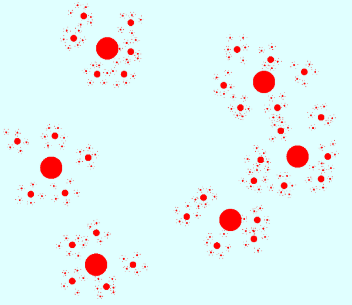

Видови машинског учења
======================

Многобројне поступке машинског учења можемо грубо да разврстамо у две велике групе, које 
називамо ненадгледано учење (енгл. *unsupervised learning*) и надгледано учење (енгл. *supervised 
learning*). Многи аутори као трећи начин учења помињу и учење поткрепљивањем (енгл. *reinforcement 
learning*). У свим овим облицима учења подразумевамо да смо изворне податке трансформисали у 
низове нумеричких својстава, па сваки податак можемо да замислимо као тачку у вишедимензионом 
простору. Овде је број димензија једнак броју својстава која користимо за представљање података, 
а вредност сваког од тих својстава је по једна координата поменуте тачке.

Ненадгледано учење
------------------

Ненадгледано учење, или учење без надзора, функционише тако што се систему за учење предочи 
велики број примера, а систем анализира дате податке и проналази различите правилности у њима. На 
основу пронађених правилности (образаца, патерна), овакав систем може да научи да дати примери 
нису равномерно распоређени у простору, већ да су на неки начин груписани, тј. да су примери у 
одређеним деловима простора много гушћи него у другим деловима. Циљ оваквог система за учење може 
да буде да дате примере организује тако да за сваки нови предочени пример уме брзо да пронађе 
сличне примере (тј. блиске тачке у хипер-простору). 

Способност система да за дати пример брзо нађе друге, сличне примере је изузетно корисна. Неке од 
примена оваквих система су:

- сегментирање корисника, које омогућава предузећима да препознају типове својих корисника, креирају 
  тзв. маркетинг персоне (замишљене типичне представнике група корисника) и тако ефикасније циљају кориснике;
- системи препоручивања, који су у стању да на основу обављене куповине предложе друге сличне артикле, који 
  би кориснику могли да буду интересантни (други који су купили то, купили су такође и ово). Овакви системи 
  се нпр. често користе за препоручивање музике, филмова, књига, видео игара и сл.
- откривање плагијаризма, тј. сличности у ауторским делима, научним радовима итд.
- лабелирање нелабелираних података, о којем ће бити више речи нешто касније

Да би био у стању да брзо нађе сличне примере, систем током тренинга обично препознаје групе сличних 
примера (тј. групе блиских тачака), које називамо кластери. Груписање података у кластере (енгл. 
*data clustering*), може да буде организовано и хијерархијски, тако да се у сваком кластеру поново 
проналазе мање групе међусобно још сличнијих података, тј. тачака на још мањем растојању.

    Кластери сличних примера, представљени блиским тачкама (хијерархијски модел)

Код хијерархијски организованих кластера, поступак при појављивању новог примера може да тече овако:
најпре се пронађе кластер чији је центар најближи новом примеру, затим се унутар тог кластера пронађе 
центар подкластера који је најближи, итд, и тако до потребног нивоа хијерархије. 

Поред раније набројаних примера, постоје и многи други проблеми у којима груписање (кластеризација) 
података из скупа за тренинг помаже да се касније нови подаци брзо сврстају у неку од раније препознатих 
група (кластера). 
Такође, након што се установи образац груписања података, може да се развије систем који на основу 
тога открива и издваја аномалије у подацима. Додатно испитивање тих аномалија доводи до чишћења 
података од грешака, а може да доведе и до откривања атипичних података, који се даље посебно третирају 
у складу са својим значајем у конкретном типу проблема.

Ненадгледано учење се користи и у многим другим доменима, које је заиста тешко систематично побројати. 
Овде можемо само да ради илустрације поменемо још пар разноврсних примера, као што су синтетисање 
говора на основу текста, проналажење оптималних стања (нпр. стање са минимумом енергије), или стварање 
креативног садржаја (компоновање музике, креативно писање, генерисање слика). 

Надгледано учење
----------------

Надгледано учење, или учење под надзором, се од ненадгледаног разликује по томе што је пре учења 
потребно да човек (или неучећи алгоритам) на улазне податке постави ознаке које представљају жељени 
излаз. Ознаке на подацима називамо и лабеле (од енгл. *labels* - ознаке, етикете), а за означене податке 
кажемо да су лабелирани. Систем за надгледано учење покушава да научи пресликавање улазних података у 
дате ознаке - лабеле. Постоје две основне варијанте надгледаног учења: класификација и регресија. 

**У проблемима класификације**, ознаке представљају одређене категорије. На пример, 

- медицинске слике унутрашњих органа могу да буду класификоване у две категорије, које представљају 
  слике здравих и оболелих органа;
- слике појединачних слова могу да буду класификоване у категорије (класе), које одговарају појединим 
  словима датог писма;
- текстуалне поруке могу да буду класификоване у две категорије: жељене и нежељене (спам) итд-

Класификација се користи да одреди којој категорији нешто припада. Програм добија велик број 
примера података које треба да класификује, заједно са ознаком (класом) којој подаци припадају, а 
учи да класификује нове, неозначене податке.

**У проблемима регресије** циљ је да се установи начин на који неки нумерички излаз зависи од улаза, 
односно да се статистички предвиди какве вредности ће имати излаз за другачији улаз. На пример, може 
да нас интересује како број поена на писменом задатку зависи од претходне оцене и времена проведеног 
у учењу, како зарада запослених зависи од њиховог образовања, старости, радног искуства и слично, 
како цена половног аутомобила зависи од модела, километраже, старости, одржавања итд. 
Регресиона анализа се и независно од машинског учења широко примењује у предвиђању и прогнозирању 
појава у разним областима, као што су економија, медицина, психологија и друге.

И регресију и класификацију можемо да посматрамо као учење неке функције, тј. пресликавања. У 
класификацији се улазни подаци пресликавају у дискретне категорије (коначан скуп вредности, често 
само две), док се у регресији улазни подаци пресликавају у непрекидну нумеричку величину.

Постоје разне технике надгледаног учења, а најпопуларније су дрвета одлучивања и неуронске мреже.
Сваки од ових приступа има своје подоблике и може да се даље разврстава.

|

Један од честих разлога због којих неки аналитички модел, добијен надгледаним учењем, може да покаже 
слабе резултате је неодговарајући капацитет за учење, с обзиром на величину скупа за тренинг. На 
пример, када је капацитет за учење превелики у односу на количину расположивих података за тренинг, 
долази до **претераног уклапања** (енгл. *overfitting*). Систем за учење у неком смислу превише добро 
научи расположиве податке, односно превише добро им се прилагоди (илустровано на следећој слици лево).

.. figure:: ../../_images/overfitting.png
    :align: center
    
    Пример претераног уклапања у податке (лево) 
    
    и грешака у тестирању или експлоатацији, насталих због тога (десно)

Када систем због недовољно података током тренинга не успе добро да генерализује проблем, касније 
неће бити у стању да добро одговори у случајевима какве није имао прилике да види (претходна слика 
десно). Проблем оверфитовања (претераног уклапања) се у идеалној ситуацији решава обогаћивањем скупа 
података за учење. Ако то није изводљиво, боље је и да се смањи капацитет система да научи дате 
примере, да би систем боље генерализовао будуће инстанце проблема. Након усклађивања капацитета за 
учење и величине скупа за тренинг, систем може да има и лошије резултате на тренингу, али ће мање 
да греши касније, на тестирању или током експлоатације.

.. figure:: ../../_images/fitting.png
    :align: center
    
    Боља генерализација (лево) доводи до боље тачности касније (десно)

Наравно, могуће је и да систем има недовољан капацитет за учење, а у том случају дешава се недовољно 
уклапање у примере из тренинга (енгл. *underfitting*). У овом случају обично треба другачије подесити 
тренинг и генерисати већи модел. На жалост, ово захтева и више меморије и процесорског времена за 
тренинг, па то може да постане уско грло.

Другачији проблем настаје када скуп података за тренинг није репрезентативан. То значи да се неки 
типови примера у скупу за тренинг појављују несразмерно ретко у поређењу са њиховом учесталошћу у 
реалној примени. Тада систем не успева да научи одређену подврсту проблема, па касније на таквим 
примерима има слабе резултате (нпр. ако се систем за детекцију лица тренира само на лицима белаца, 
касније може да греши знатно више при детектовању лица људи црне расе, него што то чини са лицима 
белаца).

Учење поткрепљивањем
--------------------

Учење поткрепљивањем је још један облик учења који можемо да запазимо и код људи и животиња. 
У многим ситуацијама у којима човек или животиња предузимају неку акцију, они немају одмах повратну 
информацију о томе колико је та акција била корисна. Повратна информација се добија само повремено, 
у виду награде или казне. При томе се не зна колико је која од појединачних акција допринела таквом 
исходу, већ само да су све оне заједно довеле до тог резултата. Временом, човек и животиња уче која 
понашања су сврсисходна, а која не. По овој аналогији са људима и животињама, од система се очекује 
низ одређених акција, без давања повратних информација након сваке појединачне акције. Код учења  
поткрепљивањем је уобичајено да се уместо израза „систем за учење“ користи реч „агент“. Као и код овог 
типа учења у природи, тек након целог низа акција агент добија одговор у виду награде или казне. 
Агент је дизајниран да научи да максимизира будућу награду на крају низа активности. То значи да 
он кроз многобројне покушаје и грешке постепено формира неку стратегију (енгл. *policy*) избора 
акција у датим ситуацијама, за коју претпоставља да доводи до највеће укупне награде.

Овај начин учења је погодан за играње стратешких игара (нпр. шах). У играма често није јасно који 
потез је добар а који није, али на крају партије агент добија информацију о томе који играч је 
победио, па је та информација његово поткрепљење, тј. награда или казна. На овај начин могу да уче 
и роботи, нпр. да се крећу у отежаним околностима, савладавају препреке, да се прикључе на пуњач, и 
слично. Такође, разни системи контроле и управљања могу кроз симулације да науче неку оптималну 
стратегију управљања (нпр. да уз минималан утрошак енергије постигну неки циљ).

Учење поткрепљивањем се јавља у многобројним варијантама, према конкретном начину на који је 
организован процес учења. Један од изазова који је заједнички разним приступима је да се пронађе 
баланс између истраживања непознатог понашања и коришћења раније откривеног корисног понашања 
(енгл. *exploration vs. exploitation*).

.. comment
    
    детекција и препознавање гестова и покрета, 
    превођење текста са језика на језик, 
    управљање роботима

    Из просветног гласника
    ----------------------

    При излиставању примера повезати вертикално и међупредметно са питањем безбедности и приватности
    (препознавање лица на друштвеним мрежама, питања приватности, безбедности, утицаја технологије на 
    промену начина обављања послова, друштвених односа уопште).

    Објаснити везу између појмова машинског учења и вештачке интелигенције.
