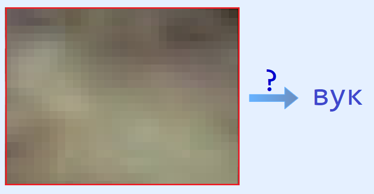
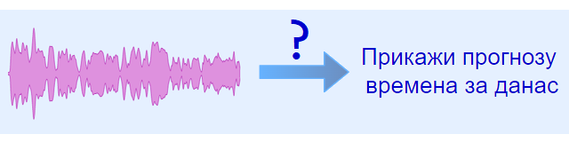
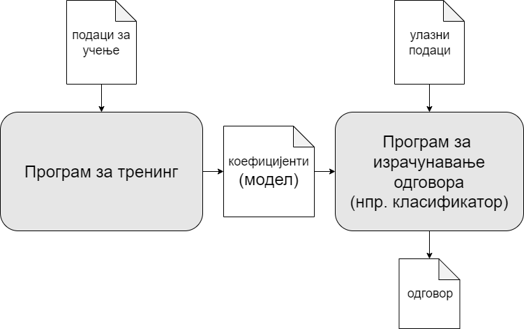
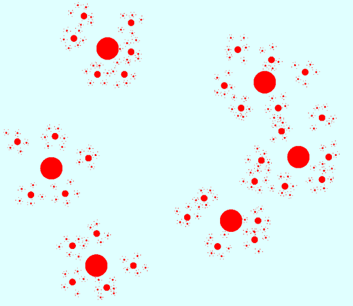
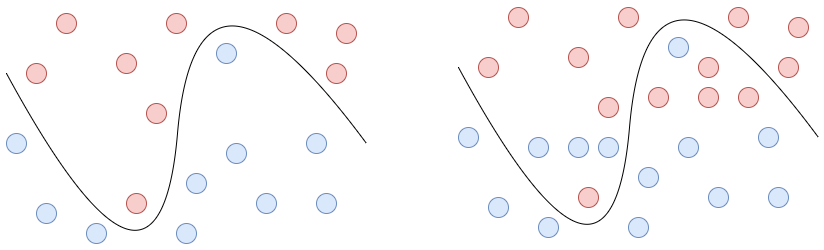
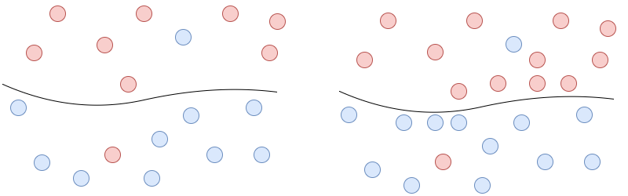

Мaшинско учење
==============

Шта је машинско учење
---------------------

**Начини задавања проблема**

Када неки проблем желимо да решимо помоћу рачунара, најпре је потребно да тај проблем на неки начин 
опишемо (прецизирамо, задамо). Код једноставнијих проблема уобичајено је да се прецизно формулише 
на који начин излаз зависи од улаза, а затим да се на основу те формулације напише програм који 
решава проблем. На пример, програм који приказује текст лако може да одреди ширине појединих речи 
у приказу и да израчуна када треба да пређе у нови ред. За рачунар је ово лако јер код оваквих 
проблема човек може да формулише прецизна правила и угради их у програм. За овакве проблеме кажемо 
да су задати **експлицитно**. Међутим, овај приступ код неких проблема није практичан, јер правила 
могу да буду компликована и са много изузетака, а често није ни могућ. Замислимо, на пример, да нам 
је потребан програм који разврстава (класификује) фотографије животиња према врсти животиње приказане 
на фотографији. Такав програм треба, полазећи од неколико стотина хиљада бројева који представљају 
слику, да израчуна одговор облика "ово је пас", "ово је мачка", "ово је коњ" и слично. Задатке овог 
типа сматрамо тешким за решавање помоћу рачунара, јер нисмо у стању да начин на који ми то радимо 
искажемо кроз прецизна правила, која би могла директно да се уграде у програм. 

    
    Како рачунару описати поступак израчунавања врсте животиње, само на основу RGB вредности 
    пиксела који чине слику те животиње? (овде је приказан само увећан детаљ слике)

Оно што можемо да урадимо у оваквим проблемима је да задатак опишемо помоћу великог броја примера, 
тј. **имплицитно**. У овом случају то би значило да рачунару за сваку врсту животиње која може да се 
појави као одговор, дамо велики број (нпр. неколико хиљада) слика те животиње. 

Разврставање слика животиња је узето као само један неутралан и популаран пример, иако не делује као 
нарочито важан задатак. Сетимо се зато и неколико сличних проблема чије решавање има већи практичан 
значај, као што је препознавање људи на основу фотографије лица, или препознавање обољења органа на 
медицинским снимцима. Поред поменутих и многих других проблема рачунарског вида, постоји још мноштво 
најразличитијих проблема који су врло незгодни за формално описивање. Знамо, на пример, да постоје 
програми који омогућавају рачунарима и мобилним телефонима да "разумеју" људски говор, односно да га 
конвертују у текст, да га анализирају и закључе какву акцију треба да предузму. 
Улаз за овакве програме је аудио запис говора, који се у основи састоји од јачина звука забележених у 
врло кратким и честим временским интервалима. Јасно је да ни у овом случају нисмо у стању да директно 
формулишемо правила, помоћу којих би се на основу тих јачина звука израчунало значење изговорене реченице.

    Поступак израчунавања значења реченице на основу њеног 
    
    аудио записа је практично немогуће задати експлицитно
    
Проверите да ли међу проблемима који се решавају помоћу рачунара можете да разликујете оне које 
умемо у потпуности да задамо експлицитно, од оних за које то нисмо у стању да урадимо.

.. mchoice:: ml_implicitno_zadati_problemi
    :multiple_answers:
    :answer_a: Програм који управља лансирањем ракете у свемир.
    :answer_b: Програм који управља аутомобилом током вожње.
    :answer_c: Програм за вођење евиденције пословања.
    :answer_d: Програм који игра шах боље од светског првака. 
    :correct: a, c

    За које од набројаних програма је човек у стању да у потпуности експлицитно опише проблем?

.. questionnote::

    Можете ли да набројите још неке проблеме који се задају експлицитно и неке који се задају имплицитно?

**Како рачунар решава имплицитно задате проблеме?**

Човек најчешће учи управо из многобројних примера, а тек након учења је у стању (и то не увек) 
да стечено знање искаже формално, кроз разна правила, дефиниције, логичке услове, једначине и 
слично. Ово у принципу важи и за сваког човека појединачно, и за људски род у целини. Сви смо, 
на пример, прво научили да просто препознајемо поједине животиње кад их угледамо, а тек знатно 
касније је разрађен систем детаљног описивања разлика између одређених сличних врста и формулисана 
су правила, тј. кључеву за класификацију. Они који се данас определе за изучавање тих прецизних 
поступака, пре тога су увелико научили да препознају животињске врсте не користећи никаква посебна 
правила (мада не толико прецизно, као уз помоћ правила). Слично томе, прво смо научили да говоримо 
просто слушајући говор, а касније смо створили разне лингвистичке дисциплине потребне за прецизно 
описивање структуре и функције говора (фонологија, морфологија, лексика, семантика, прагматика 
и друге).

Ситуација са рачунарима је сасвим другачија. Њима су неопходна правила да би могли нешто да науче. 
Они не могу да граде осећај или интуицију онако како то ради човек. Све сложене операције које 
данашњи рачунари обављају, на крају се своде на рачунање великом брзином. Зато, када је потребно 
да рачунар на основу примера научи да решава неки проблем, он у ствари покушава да израчуна правила, 
на основу којих ће касније да рачуна одговоре на питања која му постављамо. 

Сада је још мало јасније зашто је за решавање проблема помоћу рачунара експлицитан опис проблема 
много погоднији него имплицитан. Код експлицитно описаних проблема правила за израчунавање одговора 
су нам позната, па проблем може да се решава директно, поузадним и разрађеним методама програмирања. 
Са друге стране, у имплицитно задатим проблемима правила за рачунање одговора тек треба открити, а 
питање је колико успешно и на који начин то може да се уради у сваком конкретном случају. Зато проблем 
описујемо имплицитно (примерима) само када не умемо да га опишемо експлицитно (правилима). У таквим, 
имплицитно описаном проблемима, настојимо да оспособимо рачунар да сам дође до правила за израчунавање 
одговора. Када располаже само примерима, рачунар може да формира потребна правила једино на основу 
тих примера, тј. тако да формирана правила дају добар одговор у што већем броју доступних примера. 
Машине за сада могу да уче искључиво на овај начин, у оквиру кога су могући различити приступи, од 
којих ћемо неке поменути у наставку. 

Укратко, **потреба за "учењем" код рачунара се јавља само када је проблем задат имплицитно, а у том 
случају општи принцип је да се кроз анализирање примера прво израчунају правила за даље израчунавање 
очекиваних одговора**. Тиме долазимо до следеће дефиниције појма машинског учења. 

.. infonote::

    Машинско учење je област вештачке интелигенције, која се бави решавањем проблема описаних помоћу 
    примера. Предмет проучавања машинског учења су алгоритми, који кроз интензивну анализу великог 
    броја података могу да препознају одређене правилности (обрасце) у тим подацима и на основу тога 
    касније доносе одлуке без, или уз минималну људску интервенцију.

**Процес машинског учења**

Процес машинског учења одвија се у више фаза. 

- На самом почетку прецизирамо **опсег проблема** (енгл. problem scope), тј. што конкретније одређујемо 
  шта спада у проблем који решавамо, а шта не. На пример, ако желимо да направимо програм који 
  препознаје цифре 0-9 на основу њихових слика, пожељно је да прецизирамо да ли примери обухватају 
  руком писане цифре, фонтове или и једно и друго, да ли користимо само ухваћене садржаје екрана 
  (screen shots) или и фотографије бројева, границе у којима се креће резолуција слике коју програм 
  треба да препозна итд. 
- Када се проблем прецизније зада, следи **прикупљање и припрема података** за учење. Нерелевантне 
  и неисправне податке одбацујемо, а преостале податке прилагођавамо по формату уколико је потребно. 
- Када пречистимо и припремимо податке, потребно је да се боље упознамо са њиховим особинама и одлучимо 
  **на који начин ће ови подаци бити представљени систему за учење**. 
  Истина је да се изворни подаци, ма ког типа они били (слика, текст, аудио итд, као и разне комбинације 
  типова), у рачунару већ памте у облику бројева. Међутим, начин на који се подаци стандардно кодирају 
  не мора да буде и најпогоднији облик за учење. Потребно је, дакле, одредити нека нумеричка својства 
  (енгл. features) датих података, којима ће ти подаци на погодан начин да буду представљени у систему 
  за учење. Нумеричка својства која ће да представљају податке у систему за учење могу да се добију 
  класичним алгоритмима за обраду слике, звука, текста итд.
- Након трансформације изворних података у низове поменутих својстава (енгл. feature vectors), наступа 
  следећа фаза, која је вероватно и најпознатија, а то је **тренинг**. У току те фазе систем нешто учи 
  из доступних података. Зависно од вида машинског учења (види ниже), циљ учења може да буде проналажење 
  сличног раније виђеног податка, проналажење категорије (класе) којој припада податак, избор најбољег 
  понашања за ситуацију описану улазним податком и слично. Сваки систем за учење подразумева неки унапред 
  утврђен алгоритам, који се након тренинга употребљава за добијање одговора. Том алгоритму недостају само 
  одређени нумерички коефицијенти који су му потребни за израчунавање, а који се одређују током тренинга. 
  Задатак тренинга и јесте управо да изгенерише ове коефицијенте, који чине такозвани **аналитички модел**, 
  или краће - **модел**. 
- По завршетку тренинга, добијени модел се **тестира** (евалуира), тј. проверава се колико су добри 
  одговори које добијамо помоћу тог модела. Да би оцена квалитета била поузданија, приликом тестирања се 
  користе нови улазни подаци, који нису били доступни програму за тренинг.

    
    Процес учења
  
Тренинг система за машинско учење не треба схватати као једнократан посао, јер генерисани модел из 
разних разлога може да не буде довољно квалитетан. Зато је често након тестирања модела и детаљнијег 
испитивања његовог квалитета потребно да се промене нека подешавања тренинга, или да се скуп података 
за учење допуни или додатно прочисти, а затим да се тренинг покрене поново. Може да буде потребно да 
се ови кораци понове велики број пута док се не дође до модела задовољавајућег квалитета. Када се 
добије задовољавајући модел, наступа завршна фаза, а то је **употреба модела** (експлоатација), 
током које други програм користи генерисани модел, односно коефицијенте садржане у њему. Овај 
други програм решава полазни проблем тако што извршава онај раније помињани, унапред припремљен 
алгоритам над новим улазним подацима (сличним онима из скупа за тренинг), користећи у рачунању и 
коефицијенте из аналитичког модела.

**Неке карактеристике машинског учења**

Врста закључивања која се дешава у системима за машинско учење је индуктивно закључивање, од 
(многобројних) појединачних примера ка општим правилима. За ову врсту закључивања ни код људи 
нема гаранције да се применом закључака или изведених правила у сваком појединачном случају добија 
исправан, или најбољи одговор. Циљ је пре свега да се дође до правила које важи у што већем броју 
случајева. Тако се ни од система за машинско учење не очекује да буду у потпуности тачни, тј. да 
генеришу идеалан модел, тим пре што примери на којим систем учи могу да буду и делимично погрешни 
(да садрже шум), да не буду потпуно конзистентни (ни људски експерти се не слажу у свему у 
потпуности), или недовољно комплетни (да не покривају у потребној мери све значајне случајеве, тј. 
да нису репрезентативни). Због тога се и квалитет система за машинско учење, односно добијеног 
аналитичког модела оцењује само статистички. Већ смо поменули да се мера квалитета модела добија 
тестирањем на неком скупу података, који је по формату исти као и подаци за тренинг, али који није 
био доступан систему за учење током тренинга, тј. генерисања модела. Сад видимо да је због начина 
задавања и решавања проблема, статистички начин вредновања модела у ствари једино што нам је на 
располагању. Тако квалитет модела често изражавамо у виду процентуланих учесталости прављења 
одређених врста грешака (ово зависи од вида учења о коме је реч).

Кључна улога тестирања модела је да се верификује да је тренинг обављен на задовољавајући начин, 
односно да укаже на могуће принципијелне пропусте током тренинга, или слаб општи квалитет. Као 
што смо поменули, принципијелни проспусти могу да се отклоне или ублаже другачијим подешавањем 
тренинга, или прочишћавањем и обогаћивањем скупа података за тренинг. 
Осим тога, тестирање може да послужи и за поређење више релативно квалитетних модела, тако да 
можемо да изаберемо најбољи расположиви модел и употребимо га у експлоатацији. Подаци за тренинг 
се у принципу стално прикупљају, па се и тренинзи над све већим и квалитетнијим скуповима података 
стално извршавају. Када се добије успешнији модел, претходни модел који је до тада експлоатисан 
се обично веома једноставно замењује новим, бољим. Наиме, модел се типично налази у једном бинарном 
фајлу, у формату специфичном за дати начин учења и дати проблем у коме се модел примењује. То значи 
да се замена модела своди на обичну замену једног фајла. 

Видови машинског учења
----------------------

Многобројне поступке машинског учења можемо грубо да разврстамо у две велике групе, које 
називамо ненадгледано учење (енгл. unsupervised learning) и надгледано учење (енгл. supervised 
learning). Многи аутори као трећи начин учења помињу и учење поткрепљивањем (енгл. reinforcement 
learning). У свим овим облицима учења подразумевамо да смо изворне податке трансформисали у 
низове нумеричких својстава, па сваки податак можемо да замислимо као тачку у вишедимензионом 
простору. Овде је број димензија једнак броју својстава која користимо за представљање података, 
а вредност сваког од тих својстава је по једна координата поменуте тачке.

|

**Ненадгледано учење**, или учење без надзора, функционише тако што се систему за учење предочи 
велики број примера, а систем анализира дате податке и проналази различите правилности у њима. На 
основу пронађених правилности (образаца, патерна), овакав систем може да научи да дати примери 
нису равномерно распоређени у простору, већ да су на неки начин груписани, тј. да су примери у 
одређеним деловима простора много гушћи него у другим деловима. Циљ оваквог система за учење може 
да буде да дате примере организује тако, да за сваки нови предочени пример уме брзо да пронађе 
сличне примере (тј. блиске тачке у хипер-простору). 

Способност система да за дати пример брзо нађе друге, сличне примере је изузетно корисна. Неке од 
примена оваквих система су:

- сегментирање корисника, које омогућава предузећима да препознају типове својих корисника, креирају 
  тзв. маркетинг персоне (замишљене типичне представнике група корисника) и тако ефикасније циљају кориснике
- системе препоручивања, који су у стању да на основу обављене куповине предложе друге сличне артикле, који 
  би кориснику могли да буду интересантни (други који су купили то, купили су такође и ово). Овакви системи 
  се нпр. често користе за препоручивање музике, филмова, књига, видео игара и сл.
- откривање плагијаризма, тј. сличности у ауторским делима, научним радовима итд.
- лабелирање нелабелираних података, о којем ће бити више речи нешто касније

Да би био у стању да брзо нађе сличне примере, систем обично током тренинга препознаје групе сличних 
примера (тј. групе блиских тачака), које називамо кластери. Груписање података у кластере (енгл. 
data clustering), може да буде организовано и хијерархијски, тако да се у сваком кластеру поново 
проналазе мање групе међусобно још сличнијих података, тј. тачака на још мањем растојању.

    
    Кластери сличних примера, представљени блиским тачкама (хијерархијски модел)

Код хијерархијски организованих кластера, поступак при појављивању новог примера може да тече овако:
најпре се пронађе кластер чији је цнетар најближи новом примеру, затим се унутар тог кластера пронађе 
центар подкластера који је најближи, итд. до потребног нивоа хијерархије. 

Поред раније набројаних примера, постоје и многи други проблеми у којима груписање (кластеризација) 
података из скупа за тренинг помаже да се касније нови подаци брзо сврстају у неку од раније препознатих 
група (кластера). 
Такође, након што се установи образац груписања података, може да се развије систем који на основу 
тога открива и издваја аномалије у подацима. Додатно испитивање тих аномалија доводи до чишћења 
података од грешака, а може да доведе и до откривања атипичних података, који се даље посебно третирају 
у складу са својим значајем у конкретном типу проблема.

Ненадгледано учење се користи и у многим другим доменима, које је заиста тешко систематично побројати. 
Овде можемо само да ради илустрације поменемо још пар разноврсних примера, као што су синтетисање 
говора на основу текста, проналажење оптималних стања (нпр. стање са минимумом енергије), или стварање 
креативног садржаја (компоновање музике, креативно писање, генерисање слика). 

|

**Надгледано учење**, или учење под надзором, се од ненадгледаног разликује по томе што је пре учења 
потребно да човек (или неучећи алгоритам) на улазне податке постави ознаке које представљају жељени 
излаз. Ознаке на подацима називамо и лабеле (од енгл. labels - ознаке, етикете), а за означене податке 
кажемо да су лабелирани. Систем за надгледано учење покушава да научи пресликавање улазних података у 
дате ознаке - лабеле. Постоје две основне варијанте надгледаног учења: класификација и регресија. 

**У проблемима класификације**, ознаке представљају одређене категорије. На пример, 

- медицинске слике унутрашњих органа могу да буду класификоване у две категорије, које представљају 
  слике здравих и оболелих органа
- слике појединачних слова могу да буду класификоване у категорије (класе), које одговарају појединим 
  словима датог писма
- текстуалне поруке могу да буду класификоване у две категорије: жељене и нежељене (спам)

итд. Класификација се користи да одреди којој категорији нешто припада. Програм добија велик број 
примера података које треба да класификује, заједно са ознаком (класом) којој подаци припадају, а 
учи да класификује нове, неозначене податке.

**У проблемима регресије** циљ је да се установи начин на који неки нумерички излаз зависи од улаза, 
односно да се статистички предвиди какве вредности ће имати излаз за другачији улаз. На пример, може 
да нас интересује како број поена на писменом задатку зависи од претходне оцене и времена проведеног 
у учењу, како зарада запослених зависи од њиховог образовања, старости, радног искуства и слично, 
како цена половног аутомобила зависи од модела, километраже, старости, одржавања итд. 
Регресиона анализа се и независно од машинског учења широко примењује у предвиђању и прогнозирању 
појава у разним областима, као што су економија, медицина, психологија и друге.

И регресију у класификацију можемо да посматрамо као учење неке функције, тј. пресликавања. У 
класификаицији се улазни подаци пресликавају у дискретне категорије (коначан скуп вредности, често 
само две), док се у регресији улазни подаци пресликавају у непрекидну нумеричку величину.

Постоје разне технике надгледаног учења, а најпопуларније су дрвета одлучивања и неуронске мреже.
Сваки од ових приступа има своје подоблике и може да се даље разврстава.

|

Један од честих разлога због којих неки аналитички модел, добијен надгледаним учењем, може да покаже 
слабе резултате је неодговарајући капацитет за учење, с обзиром на величину скупа за тренинг. На 
пример, када је капацитет за учење превелики у односу на количину расположивих података за тренинг, 
долази до појаве познате под енглеским називом **overfitting**, што бисмо могли да преведемо као 
"претерано уклапање". Систем за учење у неком смислу превише добро научи расположиве податке, односно 
превише добро им се прилагоди (илустровано на следећој слици лево).

    
    Пример претреаног уклапања у податке (лево) 
    
    и грешака у тестирању или експлоатацији, насталих због тога (десно)

Када систем због недовољно података током тренинга не успе добро да генерализује проблем, касније 
неће бити у стању да добро одговори у случајевима какве није имао прилике да види (претходна слика 
десно). Проблем оверфитовања се у идеалној ситуацији решава обогаћивањем скупа података за учење. Ако 
то није изводљиво, боље је и да се смањи капацитет система да научи дате примере, да би систем боље 
генерализовао будуће инстанце проблема. Након усклађивања капацитета за учење и величине скупа за 
тренинг, систем ће вероватно да има лошије резултате на тренингу, али ће мање да греши касније, на 
тестирању или током експлоатације.

    
    Боља генерализација (лево) доводи до боље касније тачности (десно)

Наравно, могуће је и да систем има недовољан капацитет за учење, а у том случају дешава се недовољно 
уклапање у примере из тренинга (енгл. underfitting). У овом случају обично треба другачије подесити 
тренинг и генерисати већи модел. на жалост, ово захтева и више меморије и процесорског времена за 
тренинг, па то може да постане уско грло.

Другачији проблем настаје када скуп података за тренинг није репрезентативан. То значи да се неки 
типови примера у скупу за тренинг појављују несразмерно ретко у поређењу са њиховом учесталошћу у 
реалној примени. Тада систем не успева да научи одређену подврсту проблема, па касније на таквим 
примерима има слабе резултате (нпр. ако се систем за детекцију лица тренира само на лицима белаца, 
касније може да греши знатно више при детектовању лица људи црне расе, него што то чини са лицима 
белаца).

|

**Учење поткрепљивањем** је још један облик учења који можемо да запазимо и код људи и животиња. 
У многим ситуацијама у којима човек или животиња предузимају неку акцију, они немају одмах повратну 
информацију о томе колико је та акција била корисна. Повратна информација се добија само повремено, 
у виду награде или казне. При томе се не зна колико је која од појединачних акција допринела таквом 
исходу, већ само да су све оне заједно довеле до тог резултата. Временом, човек и животиња уче која 
понашања су сврсисходна а која не. По овој аналогији са људима и животињама, од система се очекује 
низ одређених акција, без давања повратних информација након сваке појединачне акције. Код учења са 
поткрепљивањем је уобичајено да се уместо израза систем за учење користи реч агент. Као и код овог 
типа учења у природи, тек након целог низа акција агент добија одговор у виду награде или казне. 
Агент је дизајниран да научи да максимизира будућу награду на крају низа активности. То значи да 
он кроз многогобројне покушаје и грешке постепено формира неку стратегију (енгл. policy) избора 
акција у датим ситуацијама, за коју претпоставља да доводи до највеће укупне награде.

Овај начин учења је погодан за играње стратешких игара (нпр. шах). У играма често није јасно који 
потез је добар а који није, али на крају партије агент добија информацију о томе који играч је 
победио, па је та информација његово поткрепљење, тј. награда или казна. На овај начин могу да уче 
и роботи нпр. да се крећу у отежаним околностима, савладавају препреке, да се прикључе на пуњач, и 
слично. Такође, разни системи контроле и управљања могу кроз симулације да науче неку оптималну 
стратегију управљања (нпр. да уз минималан утрошак енергије постигну неки циљ).

Учење поткрепљивањем се јавља у многобројним варијантама, према конкретном начину на који је 
организован процес учења. Један од изазова који је заједнички разним приступима је да се пронађе 
баланс између истраживања непознатог понашања и коришћења раније откривеног корисног понашања 
(енгл. exploration vs. exploitation).

.. comment
    
    детекција и препознавање гестова и покрета, 
    превођење текста са језика на језик, 
    управљање роботима

    Из просветног гласника
    ----------------------

    При излиставању примера повезати вертикално и међупредметно са питањем безбедности и приватности
    (препознавање лица на друштвеним мрежама, питања приватности, безбедности, утицаја технологије на 
    промену начина обављања послова, друштвених односа уопште).

    Објаснити везу између појмова машинског учења и вештачке интелигенције.
