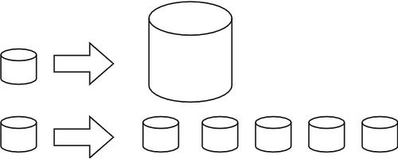

Обрада великих количина података
================================

Доношење одлука на основу података
----------------------------------

Људи на основу података често могу да дођу до тачнијих предвиђања неке појаве и да унапреде своје 
деловање. Зато постоји природно интересовање за праћење и прикупљање масовнијих података о 
најразличитијим појавама, као што су метеоролошки подаци ради прогнозе времена, параметри рада 
машине (темпрература, притисак, напрезање и др.) да би се предупредили могући кварови, подаци о 
условима (влажност, темпрература, присуство потребних хемикалија у земљишту) за раст гајених биљака 
итд. 

У данашње време, када су многи статистички подаци јавно доступни, одлуке на основу података могу да 
доносе и појединци, било да се ради о избору будућег занимања, о куповини стана, или избору начина 
лечења неке болести. Ако желите да знате више о томе како да анализирате податке и доносите одлуке 
на основу њих, погледајте и Петљине курсеве 
`Анализа (отворених) података <https://petlja.org/biblioteka/r/kursevi/jupyterRadneSveske_srb>`_ и
`Буди Data Driven - анализа и визуелизација података <https://petlja.org/kurs/6173>`_.

.. infonote:: 

    **Занимљивост:**

    Ефектан пример доношења одлука заснованих на подацима описан је у књизи `Moneyball: The Art of Winning an Unfair Game
    <https://en.wikipedia.org/wiki/Moneyball>`_ написаној по стварним догађајима (истоимени филм  - 
    *Moneyball*, код нас се појавио под насловом *Формула успеха*). Реч је о бејзбол клубу чија управа 
    је почела да доноси одлуке о куповини и продаји играча само на основу модерних и детаљних статистика, 
    не ослањајући се на процене стручњака (скаута). Клуб је проналазио играче који су према коришћеним 
    статистикама потцењени на тржишту и уз овакав приступ са сразмерно врло малим буџетом постигао 
    неслућен успех. Израз Moneyball је након ове књиге и филма ушао у ширу употребу као опис за такав 
    начин управљања било којим клубом, а понекад и за такав начин доношења одлука уопште.

Прикупљање, обрада и анализа података ради доношења одлука није новост у људском понашању, мада је у 
последње време у великој експанзији. Заправо, примерима таквог понашања је прошарана цела историја. 
Поменимо само два насумична примера. Познато је на пример, да су још у древном Египту вршени пописи 
становништа, да би се боље планирала наплата пореза и рад на изградњи пирамида. Такође је забележено 
да се у Холандији у једанаестом веку одлука о висини насипа доносила на основу статистичких података 
о висини претходних поплава. 

.. questionnote::

    | Можете ли да наведете још неке примере употребе података за доношење одлука?
    | Има ли примера који су на вас оставили посебно јак утисак?
    | По чему се данашњи примери разликују од историјских?

Развој обраде и анализе података
--------------------------------

Извлачењу корисних закључака и предвиђања из података претходи процес који обухвата прикупљање, чување, 
обраду и анализу података, представљање података на прегледан начин, тумачење примећених правилности и 
неправилности и слично. Сваки од тих поступака је у неком периоду представљао главни изазов, односно 
најслабију карику у ланцу повезаних активности. Осврнимо се сасвим кратко на тешкоће на које се наилазило, 
а којих има и данас, као и на начине на које су те тешкоће превазилажене.

**Математичка обрада (анализа) података**

Да би се подаци квалитетније обрадили, тј. да би се из њих добили што поузданији и кориснији закључци, 
развијена је математичка статистика. Саме почетке статистике је тешко датирати, али значајан напредак 
статистике се догодио у XVII и XVIII веку. Најважније примене су поново биле у вези са пописом 
становништва. Ово не треба да чуди, јер и корен речи статистика указује на то да се њено првобитно 
значење односило на неки посао за државу, тј. у вези са државним пописом. Примена статистике на податке 
добијене пописом омогућила је стварање прецизније демографске слике популације, процене шанси да се 
преживи одређено животно доба, одонсно да се одреди очекивано трајање живота и сл. 

**Чување и електронска обрада података (копирање, сортирање и сл.)**

Крајем XIX века у САД је живело преко 60 милиона људи. У то време, да би се обавио попис становништва 
било је потребно 7 година. Осим што подаци током овако дугог процеса могу значајно да се промене и 
тиме умање вредност целог посла, поступак који толико траје је сам по себи морао бити и прилично скуп 
и подложан грешкама. Да би омогућио бржу, тачнију и јефтинију израду пописа, Херман Холерит је 1890. 
године конструисао табеларну машину. Машина је користила специјално дизаниране картице стандардизованих 
димензија, што је омогућило брзу, аутоматизовану обраду (сортирање, пребројавање). Пописари би бележили 
податке бушењем картица на тачно одређени начин, а те картице су касније очитаване електронски и 
обрађиване без даље интервенције човека. Изум је брзо нашао примену и у осигуравајућим компанијама, 
а касније и у другим областима пословања. Компанија коју је Холерит основао прерасла је пар деценија 
касније у чувени IBM (ај-би-ем).

    Холеритова табеларна машина 
    
    Adam Schuster, CC BY 2.0 <https://creativecommons.org/licenses/by/2.0>, via Wikimedia Commons

    
    Холеритова табеларна машина, детаљ

    Marcin Wichary, CC BY 2.0 <https://creativecommons.org/licenses/by/2.0>, via Wikimedia Commons

**Аутоматско прикупљање података** 

Аутоматска обрада података је принципијелно отворила могућност примене у много већем броју области 
него што је то претходно био случај. Да би обрада и анализа података постала масовнија, било је 
потребно да се омогући и аутоматско прикупљање података. Са појавом интернета, а нарочито интернета 
ствари, долази до праве експлозије различитих врста података. У поглављу о интернету ствари смо 
поменули различите примене интернета ствари, које кроз прикупљање и обраду података воде ка бољим 
пословним одлукама. 

Велике количине података
------------------------

Ни данашње време није лишено изазова у процесу прикупљања, обраде и анализе података. Наиме, прикупљање 
података је постало тако ефикасно, да је поново већ само складиштење тих количина података постало 
проблем. Примера ради, један Ербасов авион на само једном лету генерише помоћу разних сензора око 
један терабајт података. Ти подаци се користе да би се потврдила исправност рада свих механизама у 
авиону, односно да би се после лета обавиле потребне интервенције и спречио настанак квара. Можда 
терабајт и не звучи као велика количина, али када узмемо у обзир да велике авио-компаније имају по 
неколико стотина авиона који просечно лете по 7 сати дневно, постаје јасно да није једноставно чак 
ни сачувати све те податке. При томе је чување података само један од проблема које треба решити 
приликом бављења тако великим количинама података.

Израз *Big Data* из енглеског језика (велике количине података) за кратко време је постао веома 
распрострањен и популаран. Мада се овај израз често чује у разговорима, представа о томе шта он тачно 
подразумева још увек је прилично магловита. Разјаснимо зато шта велике количине података чини великим.

.. questionnote::

    Које су најважније карактеристике великих количина података, тј. под којим условима за неке податке
    можемо да кажемо да су "велики"?

Кратак одговор би био: ако чување и обраду података не можемо да обавимо на уобичајени начин, говоримо о 
великим количинама података. Овде се под уобичајеном мисли на употребу једног или неколицине рачунара и 
стандардних апликација за обраду, као што су програми за табеларна израчунавања, програми који користе 
релационе базе података, програми за математичке (статистичке) прорачуне и слично. Стандардни рачунари 
и апликације се, наравно, користе и у раду са великим подацима, али они нису довољни за све потребне 
активности.

Дужи одговор описује специфичности података, због којих није могуће да са њима поступамо на уобичајени 
начин. Три кључне карактеристике великих количина података, које их разликују од података на какве смо 
навикли су обим, брзина генерисања и разноликост (енгл. volume, velocity, variety, особине великих 
података познате као три-ве).

- **Обим података:** Капацитет дискова на стандардним рачунарима данашњице је реда неколико терабајта. 
  Међутим, данас многе компаније обрађују податке реда петабајта и више. Тако велики подаци често 
  долазе са интернета ствари, али и из обраде слика, аудио и видео фајлова, са друштвених мрежа, 
  као и са обичних веб страна. Чак и ако не складиштимо одједном све податке којима се бавимо (него 
  само део који тренутно обрађујемо), за складиштење таквих количина података уобичајени приступ од 
  неколико дискова није довољан.
- **брзина пристизања података:** нови подаци се често генеришу великом брзином, па је потребно 
  обезбедити огроман проток и довољно брзу обраду. Чак и ако је капацитет везе довољан да подржи 
  толики проток, обрада свих података на једном процесору може да постане уско грло. Данашњи рачунари 
  типично извршавају неколико стотина милиона операција у секунди, што у условима велике брзине 
  пристизања података може да не буде довољно.
- **разноликост података:** Подаци који се прикупљају из различитих извора могу 
  да буду веома разнолики по својој структури и формату. По нивоу структурираности разликујемо 
  структуриране, полуструктуриране и неструктуриране податке.

  - Структурирани подаци су типично велике табеле које се састоје од редова и колона података тачно 
    одређеног типа. Такви подаци се најчешће налазе у релационим базама података, мада могу да се 
    нађу и у другим облицима и форматима (разни формати специјализованих програма за табеларна 
    израчунавања, текстуални CSV фајлови и слично).
  - Полуструктурирани подаци се обично налазе у форматима попут *Json* или *XML*. Ови подаци су 
    хијерархијски уређени, али формат допушта одређену слободу (структура не мора да буде иста у 
    свакој грани хијерархије).
  - Неструктурирани подаци могу нпр. да буду аудио и видео фајлови, слике, па и текстуални фајлови 
    у слободној форми (од књижевних дела до коментара купаца одређене компаније). Наравно, овде 
    спадају и сви други типови података који немају никакво унутрашње уређење, тј. структуру.
  
  Различитост структура и формата значи да није могуће све те податке обрађивати на исти начин, 
  једним приступом и једном апликацијом, већ су за разне врсте података потребни разни приступи.

Поред ових најважнијих специфичности великих података, постоје и друге, које нису суштинске, али се 
често срећу у пракси. 

**Ваљаност података (veracity):** Приликом прикупљања веома великих количина података неминовно ће 
неки од података бити изгубљени или оштећени. Разлог томе могу да буду разне техничке несавршености 
у поступку прикупљања података, као што су грешке у хардверу и софтверу, грешке при руковању, 
непредвиђене околности итд. Због тога је код великих података потребна посебна фаза рада, која 
подразумева проверу ваљаности, односно техничке исправноси података. На пример, у великој табели 
један део неке колоне може да буде празан (изгубљене вредности услед неке грешке). Пошто су 
количине података огромне, ручно проналажење оваквих грешака није реално изводљиво. Обично је 
потребан интерактиван рад, који укључује неке аутоматизоване кораке (нумеричке, статистичке и 
друге анализе података ради налажења грешака). Подаци се чисте од грешака и недоследности на 
различите начине, зависно од врсте уоченог проблема и области примене. На пример, ако у једном делу 
података нису присутни сви параметри, може да се одбаци део који није комплетан (ако није велики), 
или да се недостајући подаци надокнаде интерполацијом постојећих (ако је изводљиво и примерено). Неке 
недоследности могу да се отклоне једноставним реформатирањем, нпр. ако подаци нису добро раздвојени 
у колоне.

**Вредност података (value):** За конкретну анализу, с обзиром на постављени циљ, одређени подаци 
могу да буду небитни. Уклањање небитних података доприноси квалитету коначних резултата обраде, 
али ни тај део посла није једноставно обавити када података има много. Провера вредности података 
се такође често обавља интерактивно, тј. комбиновањем мануелних и аутоматских корака.

|

Из ове карактеризације великих података видимо да су главни проблеми које треба решити при раду са 
њима чување великих количина података, довољно брза обрада података који пристижу великом брзином и 
обрада података разноликих по структури и нивоу структурираности. Било који од ова три типа проблема 
је довољан да податке сматрамо великим. При томе, када карактеришемо неке податке као велике, не 
треба да се везујемо за конкретне бројчане границе, јер се оне померају са временом. Нешто што је пре 
пар деценија сматрано за огромне количине података и захтевало посебна технолошка решења, данас може 
да се обради на једном стандардном рачунару и више не спада у велике податке. Дакле, велике подаке не 
одређује нека прецизна бројчана граница капацитета за чување, пренос или обраду, већ могућности 
актуелних рачунара у датом тренутку, односно технологија потребна за рад са тим подацима. У том смислу, 
сам појам *Big Data* се не користи само за податке, него тако називамо и пратећу научно-технолошку 
област која се бави омогућавањем чувања, обраде и анализе великих количина података.

.. infonote::

    Велики подаци су област која се бави начинима за систематско издвајање информација из скупова 
    података, за анализу и друге обраде података, који су сувише велики или комплексни да би се 
    њима бавио само традиционални софтвер за обраду података.

Технологије иза великих количина података
-----------------------------------------

Дистрибуирани системи
'''''''''''''''''''''

Како се величина обрађиваних података убрзано повећава, повећавање могућности појединачних рачунара 
не може да прати тај темпо. Зато се у обради великих количина података користе дистрибуирани системи 
рачунара. Под дистрибуираним системом овде мислимо на мрежу рачунара повезаних специјализованим 
софтвером, који у што већој мери ослобађа корисника потребе да се бави расподељивањем података и 
процеса обраде на конкретне рачунаре, или да уопште води рачуна о томе на којем конкретном рачунару 
се чува и обрађује који део података. Уместо тога, дистрибуирани систем треба се представи кориснику 
као целина и своју унутрашњу комплексност држи сакривену од корисника (колико год је то могуће).

Овакви системи су постојали и током осамдесетих и деведесетих година двадесетог века, али с обзиром 
на величине тадашњих дискова (пар гигабајта), успех је био да се се омогући обрада једног терабајта 
података. Мада ове количине података данас више не сматрамо великим, оне су својеверемено послужиле 
за развој технологија које се данас користе за чување и обраду много веће количине података. 

Концепт дистрибуиране (расподељене) обраде се развијао и постепено напредовао током деценија. Један 
од значајних пројеката је *MapReduce* компаније Гугл (Google) из 2004. године, који је по архитектури 
личио на неке раније пројекте. Сам назив ("map - reduce", мапирај и смањи) донекле објашњава основни 
принцип, а то је да систем пристиглом великом задатку придружује одређени број рачунара (то придруживање 
је мапирање), тако да сваки од њих обавља мањи задатак (смањивање обима посла до нивоа изводљивог на 
једном рачунару). Резултати се затим прикупљају и испоручују кориснику као да су добијени на једном 
рачунару.

Непрофитна организација Апач (Apache) је по угледу на MapReduce израдила софтвер отвореног кода под 
називом Хадуп (`Hadoop <https://en.wikipedia.org/wiki/Apache_Hadoop>`_) и објавила га 2006. године. 
Хадуп је и данас најзначајнија бесплатна платформа за обраду великих података, мада постоје и савременије, 
као што је Спарк (`Spark <https://en.wikipedia.org/wiki/Apache_Spark>`_). 

Платформа Хадуп омогућава дистрибуирано чување и обраду великих количина податка. У оквиру ове платформе 
постоји неколико подсистема, од којих су два најважнија:

- HDFS (Hadoop distributed file system) је специјализовани софтвер који повезује рачунаре у 
  јединствен систем за чување података и омогућава удобну употребу крајњим кориснцима. У сваком 
  кластеру рачунара, један рачунар је централни и он се назива **чвор са именима** (енгл. Name node, 
  познат и као Master node), док су остали рачунари **чворови са подацима** (енгл. Data node, познати 
  и као Slave node). Чвор са именима на себи чува метаподатке, на основу којих може брзо да одговори 
  на којем рачунару су смештени који подаци. HDFS води рачуна да сваки блок података постоји у више 
  реплика (стандардно три), да подаци не били изгубљени у случају да неки од чворова са подацима 
  откаже. Сваки чвор са подацима се редовно (на сваке три секунде) јавља главном рачунару. Ове поруке 
  називамо откуцајима срца (енгл. heartbeat). Ако се нкеи чвор не одазива током два минута, главни 
  рачунар започиње процес реплицирања одговарајућих блокова података из преосталих копија на нови рачунар.
- YARN (Yet Another Resource Negotiator) је распоређивач послова на конкретне рачунаре. Систем YARN је 
  заменио старији систем MapReduce, који је имао исту намену. YARN се састоји од две главне компоненте, 
  које се називају менаџер ресурса (енгл. resource manager) и менаџер чворова (енгл. node manager). 
  Менаџер ресурса прихвата захтеве за обрадом и прослеђује делове тих захтева менаџерима чворова. 
  Менаџери чворова су инсталирани на сваки чвор са подацима и одговорни су за извршавање задатака на 
  чворовима са подацима.
  
Подршка неструктуираним подацима
''''''''''''''''''''''''''''''''

Неструктуиране податке није погодно чувати у великим табелама. Уместо у табеле, они су често организовани 
у појединачне документе или хијерархијске структуре. Нерелационе базе података које омогућавају чување 
оваквих података постоје још од краја шездесетих година двадесетог века, али је интересовање за њих 
нагло порасло почетком двадесет првог века. Околности које су погодовале расту интересовања за овакве 
базе података је драстичан пад цене складиштења података и потреба да се обрађују велике количине 
полуструктурираних и неструктуираних података. Овакве базе података су постале познате под заједничким 
називом NoSQL (not only SQL).

Рачунарство у облаку (енгл. cloud computing) је такође добило на популарности, па су програмери почели 
да користе јавне облаке за хостовање својих апликација и података. Раст количине података створио је 
потребу да се и базе података дистрибуирају на више сервера и региона, што код стандардних релационих база 
у почетку није било подржано. 

Мада свака NoSQL база података има своје специфичности, следеће особине су заједничке већини NoSQL база: 

- Флексибилне шеме: за разлику од SQL база података, где је неопхподно да се одреди и зада шема табеле 
  (називи и типови колона) пре уметања података, у NoSQL базама документи не морају да имају исту шему.
- Хоризонтално скалирање (проширивање): капацитет неког система (за складиштење, обраду) може до извесне 
  мере да расте тако што се повећавају могућности постојећих компоненти. Такво проширивање се назива 
  вертикалним. Други, бољи начин, који омогућава далеко већа проширења је додавање нових компоненти, што 
  називамо хоризонталним проширивањем.

    
    Вертикално (горе) и хоризонтално (доле) скалирање 

- Брзи упити захваљујући моделу података: у NoSQL базама подаци се често чувају као кључеви и вредности, као 
  у речницима. Оваква организација је веома ефикасна јер време за приступ подацима по кључу не зависи од 
  величине базе.
- Једноставна употреба за програмере

Најпопуларнији бесплатан систем за чување великих количина података је *MongoDB*, а од комерцијалних *Bigtable* 
компаније Гугл и *Dynamo* компаније Амазон.

