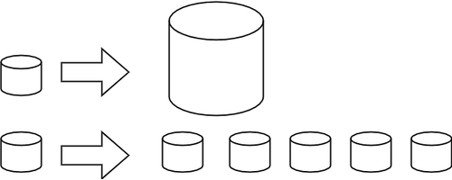

Технологије иза великих количина података
=========================================

Дистрибуирани системи
---------------------

Како се величина обрађиваних података убрзано повећава, повећавање могућности појединачних рачунара 
не може да прати тај темпо. Зато се у обради великих количина података користе дистрибуирани системи 
рачунара. Под дистрибуираним системом овде мислимо на мрежу рачунара повезаних специјализованим 
софтвером, који у што већој мери ослобађа корисника потребе да се бави расподељивањем података и 
процеса обраде на конкретне рачунаре, или да уопште води рачуна о томе на којем конкретном рачунару 
се чува и обрађује који део података. Уместо тога, дистрибуирани систем треба се представи кориснику 
као целина и своју унутрашњу комплексност држи сакривену од корисника (колико год је то могуће).

Овакви системи су постојали и током осамдесетих и деведесетих година двадесетог века, али с обзиром 
на величине тадашњих дискова (пар гигабајта), успех је био да се се омогући обрада једног терабајта 
података. Мада ове количине података данас више не сматрамо великим, оне су својевремено послужиле 
за развој технологија које се данас користе за чување и обраду много веће количине података. 

Концепт дистрибуиране (расподељене) обраде се развијао и постепено напредовао током деценија. Један 
од значајних пројеката је *MapReduce* компаније Гугл (Google) из 2004. године, који је по архитектури 
личио на неке раније пројекте. Сам назив ("map - reduce", мапирај и смањи) донекле објашњава основни 
принцип, а то је да систем пристиглом великом задатку придружује одређени број рачунара (то придруживање 
је мапирање), тако да сваки од њих обавља мањи задатак (смањивање обима посла до нивоа изводљивог на 
једном рачунару). Резултати се затим прикупљају и испоручују кориснику као да су добијени на једном 
рачунару.

Непрофитна организација Апач (Apache) је по угледу на MapReduce израдила софтвер отвореног кода под 
називом Хадуп (`Hadoop <https://en.wikipedia.org/wiki/Apache_Hadoop>`_) и објавила га 2006. године. 
Хадуп је и данас најзначајнија бесплатна платформа за обраду великих података, мада постоје и савременије, 
као што је Спарк (`Spark <https://en.wikipedia.org/wiki/Apache_Spark>`_). 

.. learnmorenote:: Више о платформи Хадуп
  
  Платформа Хадуп омогућава дистрибуирано чување и обраду великих количина податка. У оквиру ове платформе 
  постоји неколико подсистема, од којих су два најважнија:

  - HDFS (Hadoop distributed file system) је специјализовани софтвер који повезује рачунаре у 
    јединствен систем за чување података и омогућава удобну употребу крајњим кориснцима. У сваком 
    кластеру рачунара, један рачунар је централни и он се назива **чвор са именима** (енгл. Name node, 
    познат и као Master node), док су остали рачунари **чворови са подацима** (енгл. Data node, познати 
    и као Slave node). Чвор са именима на себи чува метаподатке, на основу којих може брзо да одговори 
    на којем рачунару су смештени који подаци. HDFS води рачуна да сваки блок података постоји у више 
    реплика (стандардно три), да подаци не били изгубљени у случају да неки од чворова са подацима 
    откаже. Сваки чвор са подацима се редовно (на сваке три секунде) јавља главном рачунару. Ове поруке 
    називамо откуцајима срца (енгл. heartbeat). Ако се неки чвор не одазива током два минута, главни 
    рачунар започиње процес реплицирања одговарајућих блокова података из преосталих копија на нови рачунар.
  - YARN (Yet Another Resource Negotiator) је распоређивач послова на конкретне рачунаре. Систем YARN је 
    заменио старији систем MapReduce, који је имао исту намену. YARN се састоји од две главне компоненте, 
    које се називају менаџер ресурса (енгл. resource manager) и менаџер чворова (енгл. node manager). 
    Менаџер ресурса прихвата захтеве за обрадом и прослеђује делове тих захтева менаџерима чворова. 
    Менаџери чворова су инсталирани на сваки чвор са подацима и одговорни су за извршавање задатака на 
    чворовима са подацима.
  
Подршка неструктуираним подацима
--------------------------------

Неструктуиране податке није погодно чувати у великим табелама. Уместо у табеле, они су често организовани 
у појединачне документе или хијерархијске структуре. Нерелационе базе података које омогућавају чување 
оваквих података постоје још од краја шездесетих година двадесетог века, али је интересовање за њих 
нагло порасло почетком двадесет првог века. Околности које су погодовале расту интересовања за овакве 
базе података је драстичан пад цене складиштења података и потреба да се обрађују велике количине 
полуструктурираних и неструктуираних података. Овакве базе података су постале познате под заједничким 
називом NoSQL (not only SQL).

Рачунарство у облаку (енгл. cloud computing) је такође добило на популарности, па су програмери почели 
да користе јавне облаке за хостовање својих апликација и података. Раст количине података створио је 
потребу да се и базе података дистрибуирају на више сервера и региона, што код стандардних релационих база 
у почетку није било подржано. 

Мада свака NoSQL база података има своје специфичности, следеће особине су заједничке већини NoSQL база: 

- Флексибилне шеме: за разлику од SQL база података, где је неопхподно да се одреди и зада шема табеле 
  (називи и типови колона) пре уметања података, у NoSQL базама документи не морају да имају исту шему.
- Хоризонтално скалирање (проширивање): капацитет неког система (за складиштење, обраду) може до извесне 
  мере да расте тако што се повећавају могућности постојећих компоненти. Такво проширивање се назива 
  вертикалним. Други, бољи начин, који омогућава далеко већа проширења је додавање нових компоненти, што 
  називамо хоризонталним проширивањем.

    
    Вертикално (горе) и хоризонтално (доле) скалирање 

- Брзи упити захваљујући моделу података: у NoSQL базама подаци се често чувају као кључеви и вредности, као 
  у речницима. Оваква организација је веома ефикасна јер време за приступ подацима по кључу не зависи од 
  величине базе.
- Једноставна употреба за програмере.

Најпопуларнији бесплатан систем за чување великих количина података је *MongoDB*, а од комерцијалних *Bigtable* 
компаније Гугл и *Dynamo* компаније Амазон.

