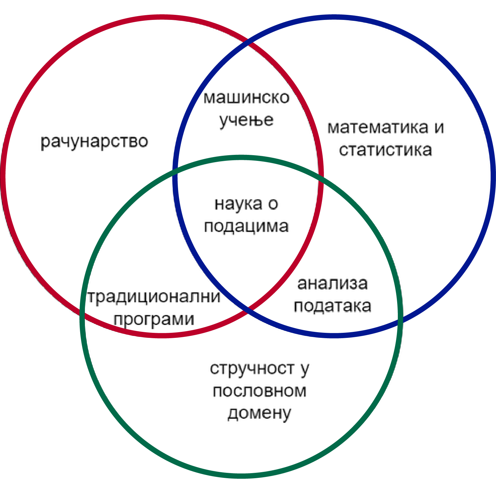

Анализа података и наука о подацима
===================================

Анализа података је процес чишћења, испитивања и визуелизације података, са циљем откривања вредних 
увида и доношења паметнијих пословних одлука. Посао аналитичара података је интерактиван, током кога 
он или она покушава на различите начине да извуче корисне информације из масе података. Овде можемо да 
разликујемо истраживачку анализу података (идентификовање образаца и односа у подацима) и потврђујућу 
(енгл. confirmatory) анализу података, која примењује статистичке технике како би се утврдило да ли 
је претпоставка о одређеном скупу података тачна. Методе којима се служи аналитичар података обухватају 
груписање података у одређене категорије и праћење вредности одређених статистичких параметара по 
категоријама, пивотирање података, креирање различитих погледа на податке и слично. Овакво схватање 
посла данас можемо да назовемо традиционалним, јер је формирано пре појаве великих података. 

Јасно је да овај, традиционалан приступ, није примерен анализи велике количине података, јер човек 
није у стању да на исти начин стиче увиде из веома великих количина података, као што то чини са 
умереним количинама података. Анализа података може да буде временски захтевна и зато традиционални 
аналитичари критикују настали талас интересовања за обраду великих количина података. Они сматрају да 
су очекивања од великих података нереална, јер велике количине података није могуће квалитетно обрадити 
у разумном времену, нарочито када су подаци разнолики по структури. 

Као одговор на растуће потребе за обрадом и анализом великих количина података, појавила се нова научна 
дисциплина, коју зовемо **наука о подацима** (енгл. data science). Енглески термин за професионалца 
у овој области (data scientist) можемо да преведемо као научник за податке.

Наука о подацима укључује све од раније познате методе анализе података, али и неке нове, које су 
пре свега усмерене на савладавање проблема проистеклих из величине и разноврсности скупова података 
које треба анализирати. Због величине података, потребно је укључити и неке облике аутоматске анализе 
података. Са друге стране, извлачење корисних информација из података који су често неструктурирани 
и врло разноврсни било би прилично тежак задатак за класичан рачунарски програм. Међутим, пошто се ради 
о веома великим количинама података, могуће је применити машинско учење и на тај начин обезбедити 
аутоматску обраду. 

Посао научника за податке је такође истраживачки, као и посао аналитичара податка. Међутим, док 
се време за један корак у истраживању код аналитичара података изражава у десетинама минута, једна 
итерација научника за податке може да траје и неколико дана, зависно од величине скупа података. 
Научник за податке је врло често у ситуацији да за сваки експеримент над подацима пише одговарајући 
програмски кôд, који на неки начин трансформише оригиналне податке. На пример, сваки ентитет из 
оригиналних података може да се представи неким низом бројева фиксне дужине. Ови бројеви могу да се 
организују у табелу, тако да редови представљају ентитете, а колоне могу да се схвате као одређене 
особине ентитета (енгл. features), изражене нумерички. Проучавањем статистичке расподеле бројева у  
колонама, може да се уочи које колоне (тј. особине) су погодне за машинско учење. Сам процес машинског 
учења се такође састоји од многобројних експеримената, почевши од избора приступа, до подешавања 
параметара учења.

Да бисмо што боље разумели специфичности послова од којих се састоје анализа података и наука о 
подацима, тј. разлике међу њима, згодно је да их прикажемо помоћу табеле.

.. list-table:: Анализа података и наука о подацима
   :widths: 15 50 50
   :header-rows: 1

   * - Особина
     - Анализа података
     - Наука о подацима
   * - Употреба дистрибуираних система
     - нема потребе
     - да, Hadoop, Spark, или неки комерцијалан систем (Microsoft Azure, Oracle и други)
   * - Типично складиштење података
     - SQL базе података 
     - SQL и NoSQL базе, фајлови у одговарајућем формату за дати тип података
   * - Укључује програмирање?
     - углавном не, могуће ради визуализације података (Python , R)
     - да, често (Python, могуће MATLAB, C++ и разни други програмски језици)
   * - Типични алати
     - Excel, SAS, Tableau, Power BI, SPSS
     - Развојна окружења за програмирање, специфични програми за манипулацију одговарајућим типом 
       неструктурираних података, по потреби и Excel
   * - Потребна знања
     - Добро познавање статистике, спретност у класичном руковању подацима, 
       разумевање области пословања из које долазе подаци
     - Машинско учење (са свим што то укључује, нпр. статистика, линеарна алгебра), програмирање, 
       рад у дистрибуираним системима, а затим у извесној мери и знања потребна за анализу података 
   * - Намена
     - Пре свега снимање тренутног начина пословања и тражење могућности да се пословање унапреди у 
       кратком року; дефинисање најважнијих нумеричких показатеља доброг пословања 
       (KPI's - key performance indicators) и њихова визуелизација
     - Дугорочна инвестиција ради откривања нових трендова у великим подацима, са циљем да се предвиди 
       будућност и препозна потреба за крупнијим променама или нове пословне прилике

Примене науке о подацима
------------------------

Када научник за податке креира модел који аутоматски анализира податке, могућа је масовна експлоатација 
тог модела са приличним успехом. Наравно, пожељно је да се подаци током експлоатације и даље прикупљају 
и користе за даље унапређивање модела. Многи такви модели аутоматске анализе података су већ успешно 
примењени. Набројеаћемо само неке од најпознатијих.

- **Преваре и откривање ризика**: једна од првих примена науке о подацима је била у финансијама. 
  Да би што боље процениле ризик од неизвршења обавеза и избегле лоше уговоре, банкарске компаније 
  су користиле прикупљене податке о пословању за профилисање клијената (њихови ранији кредити и 
  друге битне варијабле). Оваква аутоматизована анализа им је помогла да унапреде понуду услуга на 
  основу куповне моћи купаца, односно да прецизније таргетирају клијенте.
- **Здравствена заштита**: важна област у којој је примена науке о подацима уштедела огромно време 
  стручњацима је здравсто, и то у неколико врло различитих поддомена.

  - Анализа медицинских слика: наука о подацима се користи при откривању тумора, стенозе артерија, 
    класификацији текстуре плућа и другим процедурама. Због огромне количине података користе се 
    дистрибуирани системи, а оптималне вредности параметара се добијају разним техникама машинског 
    учења.
  - Генетика и геномика: истраживање генетике довело је до већег разумевања утицаја ДНК на наше 
    здравље, али реакције појединаца на лекове су често веома различите. Наука о подацима се користи 
    за откривање везе између генетике, болести и одговора појединца на лекове. Ово омогућава 
    квалитетнији персонализовани третман. 
  - Развој лекова: да би се дошло до новог лека, потребан је низ година и милијарде лабораторијских 
    тестова. Наука о подацима може да убрза и појефтини тај процес, тако што предвиђа стопу успеха 
    појединих експеримената на основу биолошких фактора. На тај начин само најперспективније идеје 
    улазе у касније фазе, укључујући лабораторијске експерименате и тестирање на живим бићима.
  - Аутоматска асистенција пацијентима и корисничка подршка: Мобилне апликације које користе вештачку 
    интелигенцију могу да пруже основну здравствену подршку, обично као чет ботови. Корисник може да 
    опише своје симптоме и да добије најважније информације о свом здравственом стању. Овај приступ 
    пацијентима штеди време одласка у центар здравствене заштите и чекања на заказани преглед, а лекарима 
    омогућава да се фокусирају на критичније случајеве.
  
- **Претрага интернета**: Претраживачи веба, као што су Гугл (Google), Јаху (Yahoo), Бинг (Bing), Аск 
  (Ask), АОЛ (AOL) итд. користе науку о подацима да би у делићу секунде дали што бољи одговор на наш 
  упит. Примера ради, познато је да само Гугл кроз разне напредне алгоритме пропушта више од 20 
  петабајта података сваког дана.
- **Циљано оглашавање**: рекламирање на масовним медијима је веома скупо. Зато оглашивачи покушавају 
  да своје рекламе што прецизније упуте својој циљној групи, јер на тај начин могу ефикасније да 
  искористе уложена средства. Ово се односи на избор локације у граду, или избор догађаја на којима 
  ће се реклама појавити на билборду, а у последње време све више на избор корисника на друштвеним 
  мрежама и посетилаца популарних сајтова, којима се упућује реклама. Одлуке о овим изборима се 
  доносе помоћу науке о подацима. Тако један посетилац сајта може да угледа рекламу за путовање, док 
  други у исто време на истом сајту види рекламу за одређену врсту хране или неки филм. Захваљујући 
  томе, дигитални огласи постижу много бољу стопу броја позива (CTR, call-through rate) него 
  традиционалне рекламе. Параметри који се користе за одлучивање су претходно понашање корисника на сајту, 
  а могу да се користе и друге особине корисника, ако су доступне. Зато су профили корисника постали 
  предмет врло уносног трговања.
- **Препоруке на веб сајту**: приликом онлајн куповине или изнајмљивања филма, често се дешава да на сајту 
  добијемо препоруку шта би још могло да нам буде интересантно. Те препоруке су такође резултат примене 
  науке о подацима, а као полазне информације се користе раније претраге клијената.
- **Напредно препознавање слика**: вероватно знате да неки претраживачи, попут Гугла, омогућавају да 
  потражите слику на интернету, тако што је отпремите као упит (reverse image search). 
  
  .. image:: ../../_images/pretraga_slika.png
    :align: center
    
  Исто тако, након постављања слике са пријатељима на одређеним друштвеним мрежама добијате предлог 
  да означите своје пријатеље. Алгоритми за проналажење слика сличних датој, као и алгоритми за 
  препозавање лица, развијени су користећи науку о подацима и машинско учење.
  
- **Препознавање говора**: Познати примери масовне употребе препознавања говора су дигитални асистенти 
  (Алекса, Сири, Кортана, Гугл војс и други). Алгоритми препознавања говора су настали уз помоћ науке о 
  подацима, а имају потенцијал за много озбиљније примене од кућних помоћника.
- **Видео игре**: многи произвођачи видео игара користе машинско учење да би прилагодили понашање 
  противника у игри (рачунара) нивоу играча и тиме игру учинили занимљивијом сваком играчу.
- **Налажење партнера**: алгоритми за упаривање усамљених такође су засновани на науци о подацима.

