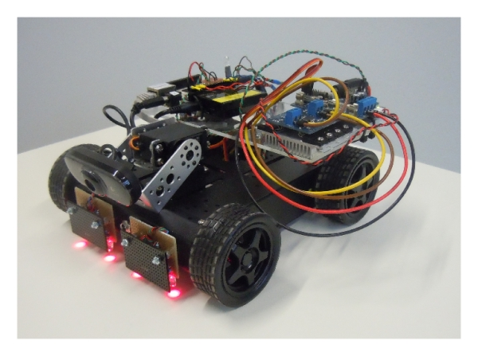

Роботика
========

Већ на основу саме речи роботика, јасно је да је централни појам ове области робот. Зато је природно 
да роботику и дефинишемо посредно, ослањајући се на појам робота.

.. infonote::

    **Роботика** је инжењерска дисциплина која се бави дизајном, конструкцијом и радом робота. 
    
Добро, али **шта је робот**? Одговором на то питање бавићемо се у наставку. Кренимо од основних 
карактеристика робота, помоћу којих ћемо бити у стању да нешто прецизније одредимо шта може да 
се сматра роботом, а шта не. Како ви разумете реч робот? Одговорите на следећа питања у складу са 
својим разумевањем ове речи. Ако сте у прилици, размените аргументе са неким ко је дао другачије 
одговоре. 

.. mchoice:: robotika_pitanje_izgled
    :answer_a: Не морају ни по чему да личе ни на људе ни на животиње, има робота који изгледају и функционишу сасвим другачије.
    :answer_b: Да би нешто било названо роботом, треба бар по нечему да личи на људско биће или животињу, иначе је обична машина.
    :correct: a

    Колико роботи личе на људска бића и животиње по свом изгледу и начину рада?

.. mchoice:: robotika_pitanje_pokretljivost
    :answer_a: Роботи су углавном покретни, али могу да буду и потпуно непокретни.
    :answer_b: Да би нешто било названо роботом, мора (поред других осообина) да има бар делове који су покретни.
    :answer_c: Робот мора да буде у стању да се креће, тј. да мења свој положај као целина.
    :correct: b

    Колико су роботи покретљиви?
    
Поред ова два, може се поставити још много питања о особинама робота, које би могле да послуже за 
дефинисање појма робота. Међутим, на нека питања није лако дати прецизан одговор, јер се и схватање 
робота мењало са временом, а и даље се мења. Нека особина може да буде карактеристична за велику 
већину робота, али могу да постоје и неки рани или супермодерни роботи који се по датој особини 
разликују од типичних. Имајући ово у виду, одговорите на следећа питања и размислите о могућим 
изузецима: да ли их има и какви би могли да буду. По могућности продискутујте своје одговоре у групи.

.. questionnote::

    | Да ли роботи функционишу без помоћи човека?
    | Колико су роботи способни да опажају своје окружење?
    | Да ли се роботи понашају интелигентно (у смислу који смо описали у одељку о вештачкој интелигенцији)?

    
Особине робота
--------------

**Да ли су роботи човеколики?**

Реч робот је прво почела да се користи у литератури, а инжењери и научници су је касније преузели. 
У романима и филмовима научне фантастике, роботи су често приказани тако да својим изгледом, 
покретима и другим особинама подсећају на људе. Чак је постало популарно да људи испрекиданим 
покретима и механичким гласом имитирају роботе који (неспретно) имитирају људе. У неким романима 
и филмовима појављују се и полумеханички организми који се састоје од вештачих и природних делова. 
Оваква представа о роботима је присутна у популарној култури, од вицева и цртаних филмова до 
дискотека. Постоје и стварни хуманоидни роботи, као што је чувени 
`Асимо <https://sr.wikipedia.org/wiki/АСИМО>`_ кога смо 2012. године имали прилике да видимо и 
у Србији. Ипак, у примени су много чешћи роботи који ни по чему не подсећају на људе или животиње 
На пример, индустријски роботи типично немају хуманоидни изглед. 

**Да ли су роботи покретљиви?**

Роботи су по неким особинама слични рачунарима, али рачунаре ипак не називамо роботима. Зашто? 
Најважнија разлика између робота и рачунара је то што се рачунари не крећу, односно не обављају 
механичке радње. Исто тако, ни друге машине које се не крећу не сматрамо роботима. Према томе, 
покретљивост се сматра за једну од кључних особина робота, која га разликује од других, сличних 
машина. Роботи могу да буду стационарни (као на следећој слици), али у том случају имају 
покретне делове намењене обављању неког физичког посла. У последње време све популарнији су и 
покретни (мобилни) роботи.

.. figure:: ../../_images/Industrial-robots.jpg
    :align: center
    
    Стационарни индустријски роботи
    
    (ISAPUT, CC BY-SA 4.0 <https://creativecommons.org/licenses/by-sa/4.0>, via Wikimedia Commons)

**Да ли су роботи самостални (аутономни)?**

Једна од битних карактеристика робота је висок ниво самосталности. У познатим случајевима масовне 
употребе, након што се припреме за употребу, роботи делују аутономно, тј. без људске помоћи. Човек 
обично надгледа рад робота због могућности квара или непредвиђених околности, али у нормалним 
ситуацијама нема потребе да помаже роботу у његовом раду. Модерни роботи се све више оспособљавају 
да самостално препознају престанак услова за нормалан и несметан рад и да адекватно реагују и у 
таквим ситуацијама (од једноставног заустављања и слања извештаја о ситуацији, преко искључивања 
струје у просторији, покретања других аутоматских процеса до узбуњивања). Све ово смањује ниво 
неопходног сталног надзора над радом робота и растерећује човека.

Поменимо да постоје и роботи који су даљински управљани, али и даље имају неки ниво самосталности. 
То могу да буду нпр. роботи дизајнирани за обављање веома опасних послова, код којих није поента 
да се човек потпуно ослободи потребе да управља роботом, него да максимизира шансе за успех мисије, 
а да се при томе не излаже ризику. У таквим применама евентуални неуспех робота може да буде много 
скупљи од људског времена. Осим тога, због повишеног ризика од оштећења таквог робота, акценат при 
његовом дизајну је више на поузданости и издржљивости, него на логици која би му обезбедила 
овде не толико битну, потпуну самосталност.

**Да ли роботи нужно "осећају" околину?**

Роботи добијају информације о околини преко разних сензора, о чему ћемо још говорити. У раној фази 
роботике, неки сензори који би били изузетно корисни ипак нису уграђивани у роботе, пре свега зато 
што је у то време било веома тешко да се рачунски обраде и адекватно искористе сви подаци који стижу 
са сензора. Поставља се питање да ли у данашње време аутономне машине са покретљивим деловима, али 
без икаквих сензора, треба убрајати у роботе? Око одговора на ово питање став није јединствен, али 
преовладава мишљење да машине које ни на који начин не осећају околину не треба сматрати роботима. 

.. questionnote::

    Можете ли да набројите неке уређаје или машине који функционишу самостално, имају покретне делове 
    помоћу којих обављају неке механичке радње, са или без сензора, а ипак их не називамо роботима?
    Да ли бисте неке од тих уређаја или машина назвали интелигентним?

**Да ли се роботи понашају интелигентно?**

Пошто смо сензоре већ уврстили у обавезну опрему робота, подразумева се да податке са тих сензора 
треба и искористити. За то су потребни алгоритми, који податке са сензора користе за израчунавања 
на основу којих доносе одлуке и тиме повећавају способност (употребљивост) робота. То је управо оно 
што сматрамо интелигентним понашањем код робота.

~~~~

Након анализе особина робота, долазимо до једне од могућих дефиниција овог појма, која је доста 
широко прихваћена.

.. infonote::
    
    Робот је аутономна машина способна да осети своју околину, да врши прорачуне за доношење одлука 
    и извршава различите радње у стварном свету.

Из дефиниције није јасно о каквим, тј. колико сложеним радњама се ради. Још важније, није јасно 
ни шта све робот треба да буде у стању да обави без људске помоћи, какве одлуке да доноси, односно 
који ниво самосталности треба да достигне. Такви детаљи у дефиницији намерно нису прецизирани, јер 
су у различитим периодима роботике очекивања од робота прилично разликовала. Некада се, на пример, 
машина сматрала самосталном ако је била у стању да аутоматски понавља једну радњу. Данашња очекивања 
од робота у погледу самосталности су далеко већа, а разумно је очекивати да она у будућности наставе 
да расту. Слично важи и за сложеност покрета и друге детаље. Према томе, одређена непрецизност у 
дефиницији је потребна, да би она била довољно општа да обухвати до сада направљене разнолике 
машине које сматрамо роботима, као и оне за које се очекује да ће бити направљени. Дефиниција није 
идеална и може јој се штошта замерити, али даје солидан оквир за разумевање појма робота.

Укратко, можемо да кажемо да су основне карактеристике савремених робота **самосталност (аутономност)**, 
**покрет**, **опажање** и **интелигентно понашање** (у смислу који смо описали у одељку о вештачкој 
интелигенцији). При томе, робот може, а не мора да опонаша жива бића својим изгледом или начином 
функционисања.

Делови робота
-------------

Роботи могу да се веома разликују по сложености, па самим тим и по деловима од којих се састоје. 
Овде ћемо пре свега поменути делове које морају да имају практично сви роботи, па и они најједноставнији, 
какви могу да се уз извесно знање и спретност израде и на школској секцији. За оне које интересује 
градња робота, поменимо да улагања у материјал за једноставније типове нису велика, а на интернету 
постоји обиље занимљивих идеја, па и разрађених пројеката који могу да послуже за увежбавање у 
градњи робота и учење о њима. Као уводни корак и припрему за градњу робота, заинтересованима предлажемо 
да погледају приручник 
`Програмирање микробит уређаја у Микропајтону <https://petlja.org/biblioteka/r/kursevi/microbitprojektna>`_, 
као и `Управљање електромеханичким моделима помоћу микробит уређаја <https://petlja.org/biblioteka/r/kursevi/prirucnik_tit8cyr>`_.

Делове потребне за градњу робота можемо грубо да поделимо у електронске, електромеханичке и механичке. 
Најважнија електронска компонента робота је **микроконтролер** (енгл. *microcontroller*). Он се 
састоји од релативно једноставног микропроцесора (у односу на оне у савременим рачунарима) и постојане 
меморије малог капацитета, смештених на штампаној плочи која је често тек толика да на њу стану поменути 
делови и прикључци за повезивање са другим уређајима. Уколико је потребно, може се користити и већа 
штампана плоча, на коју може да се смести више прикључака и електронских компоненти попут додатних 
чипова (интегрисаних кола), отпорника, кондензатора, транзистора, диода, тастера итд. Таква плоча, 
која повезује већи број компоненти се, као и код рачунара, назива **матична плоча**. 

Микроконтролер може да се повеже и са рачунаром, што му омогућава да са њега преузме програм који 
управља роботом, као и да се лакше обави тестирање и открију евентуални проблеми. Могуће је и да се 
више микроконтролера међусобно повежу и сарађују у управљању роботом. Друге компоненте које се путем 
каблова повезују са једним од микроконтролера (ако их је више) су прекидачи, мотори и разне врсте сензора. 

Типична улога микроконтролера је да преко улазних прикључака прима податке од сензора, да обрађује 
те податке помоћу програма који се налази у постојаној меморији и да преко излазних прикључака 
шаље команде, тј. управљачке сигнале уређајима који те команде извршавају. Уређаји који извршавају 
команде се називају актуатори и о њима ће ускоро бити речи.

Уколико микроконтролер нема капацитет (нпр. довољан број прикључака) за примање и слање свих потребних 
сигнала, он може (као што је речено) да се преко улазних и излазних прикључака повеже са другим 
микропроцесорима и са њима размењује сигнале. На тај начин микроконтролер преноси неке од поменутих 
функција на друге микроконтролере.

У електронске компоненте спадају и разне стандардне целине које се називају **електронски склопови**. 
Тако имамо склопове за напајање, појачиваче, осцилаторе итд. Склопови могу да се налазе на матичној 
плочи, а могу да имају и своје штампане плоче. 

    
    Покретни робот
    
    Piotr Stawicki, Felix Gembler, Ivan Volosyak, CC BY 4.0 
    
    <https://creativecommons.org/licenses/by/4.0>, via Wikimedia Commons

**Сензори**, или давачи сигнала су уређаји који мере разне физичке величине и претварају их у 
електрични сигнал. Нове технологије омогућавају прављење сензора веома малих димензија, тзв. микросензора.
Сликовито речено, сензори представљају "чула" робота и снабдевају га подацима о његовој околини. 

Према природи величине коју мере, сензори могу да буду топлотни (мере температуру или проток топлоте), 
електромагнетни (мере електрични отпор, струју, напон, снагу, јачину или промену магнетног поља и 
друго), механички (мере притисак, проток флуида, густину флуида, вискозност, напрезање, растојања, 
убрзања, влагу, ниво течности и др.), хемијски (сензори кисеоника, детектори угљен-моноксида, сензори 
мириса тј. различитих гасова итд.), оптички (светлосни сензори или фотодетектори, инфрацрвени сензори), 
акустички (користе временско кашњење простирања ултразвучних таласа за мерење даљине и детекцију покрета), 
звучни (микрофон, сеизмометар) и други.

Сензори се често монтирају на робота споља, јер су и намењени опажању околине, тако да и поред често 
малих димензија лако могу да се уоче простим посматрањем робота. 

.. questionnote::

    | Шта мислите, којим од ових типова сензора се роботи најчешће опремају, нарочито они покретни?
    | На ком принципу ради, односно коју физичку величину мери жироскоп? 
    | Како би могао да се детектује ударац, како благи додир, а како непосредна близина објекта (proximity)?
    | Који сензори могу да се налазе у унутрашњости робота?

На основу информација са сензора робот одлучује када да започне задатак, како да избегне или савлада 
препреку, како да реагује на разне промене, а коначно и да ли је задатак обављен, односно да ли треба 
одустати од даљих покушаја. 

**Актуатори** (енгл. actuator - покретач, погон) код робота реагују на управљачке сигнале који стижу 
са микроконтролера и користећи неки извор енергије остварују механичко кретање, тј. промену положаја 
робота или његовог дела. Као извор енергије, актуатори најчешће користе електрично напајање. Такви 
актуатори су различите врсте електромотора (мотори једносмерне струје, корачни мотори, серво уређаји). 
Електромотори производе кружно (ротационо) кретање, па су погодни за покретање точкова, зглобова и сл.
Актуатори могу да користе и друге изворе енергије. На пример, пнеуматски актуатори користе ваздух 
под притиском да преко цилиндра остваре праволинијско кретање, док се потпритисак користи у вакуумским 
хватаљкама и механичким вакуумским стопалима за кретање по веома стрмим подлогама.

Одлука о томе да ли ће се робот кретати помоћу точкова или механичких ногу зависи од његове намене. 
За кретање по равном терену точкови су довољно добри, док се за неравне и стрме терене (укључујући и 
контранагиб, као код кретања по таваници) користе моћнији механизми попут механичких ногу, који су 
знатно сложенији, како за реализацију, тако и за координацију и управљање.

Неке примене робота
-------------------

**У индустрији**

Прве и до сада најмасовније примене робота биле су у индустрији. Улога робота у почетку је била да 
по утврђеним трасама довозе сировине до обичних фабричких машина, као и да одвозе и слажу 
полупроизводе и готове производе. Са напретком науке и технологије, добијени су роботи који 
могу нпр. да учествују у склапању аутомобила и електронских уређаја. У таквим, прецизним али 
рутинским и монотоним пословима, човек је склон грешкама услед замора. Зато је пожељно да 
такви процеси што мање зависе од човека. Данашњи роботи захваљујући камерама и другим сензорима 
захтевају мање финих подешавања и могу више да се прилагоде задатку. Мада (још увек) нису у 
потпуности преузели производњу, роботи су као много бржи и поузданији од људи, значајно повећали 
продуктивност и квалитет производа у фабрикама у којима се примењују.

Први индустријски роботи су били крајње опасни по човека, јер нису имали начина да региструју његово 
присуство. Зато су људи морали строго да воде рачуна о процедурама при раду са роботом (нпр. када 
смеју да приђу роботу ради повремене интервенције). Да би се избегли несрећни случајеви, роботи су 
смештани у кавезе, а отварање врата кавеза би заустављало рад робота. 

Данас постоје и тзв. **колаборативни роботи**, или скраћено 
`коботи <https://en.wikipedia.org/wiki/Cobot>`_, који су знатно безбеднији по човека. Безбедност може 
да се постигне на различите начине, као што су 

- опремљеност већим бројем сензора који детектују присуство човека и контакт са њим, што овим роботима 
  омогућава да помоћу софтвера прилагоде понашање и избегну повређивање човека
- ограничавање брзине делова робота и силе која се примењује при њиховом померању
- употреба лакших материјала са заобљеним ивицама при изради робота, што смањује тежину повреде у 
  случају да до ње ипак дође

На тај начин, роботи и људи могу да раде у истом простору без опасноти по човека. 

**У лабораторији**

Као и у фабрикама, научна истраживања у лабораторијама често захтевају велики број понављања неког 
монотоног поступка. Као што је поменуто, роботи су у таквим пословима одавно превазишли људе. Тако 
су се, на пример, роботи показали као незаменљиви при развоју нових фармацеутских производа. Додатни 
разлог за употребу робота у овим пословима је безбедност, јер се смањује изложеност људи разним 
хемијским средствима или бактеријама, као и могућност проблема који могу да настану због људских 
грешака.

Роботи се из истих разлога (брзина, поузданост, безбедност по човека) користе и за биомедицинске 
анализе људских узорака (нпр. крви) и друге послове у лабораторијама. 

**У кући**

Већ одавно су доступни роботи који умеју да обављају кућне послове попут усисавања прашине, брисања 
пода и слично. Овакви уређаји углавном немају могућност оријентације у простору, већ се у случају 
наиласка на препреку само упућују у другом правцу. Напреднији роботи овог типа за откривање препрека 
користе ултразвучне сензоре, али и даље могу да имају проблема (могу нпр. да падну низ степениште). 
Уколико се овакви роботи крећу по отвореном простору (нпр. робот за кошење траве у дворишту), потребно 
је дуж граница предвиђеног простора обезбедити сигнал који их зауставља (нпр. електрични или магнетни).

Роботи могу да служе и за обезбеђивање стана или куће. Такви роботи су способни да открију дим и тако 
спрече пожар, или да у случају провале обавесте власника и полицију. Пошто су опремљни камерама и 
мобилним телефоном, власник може да види све што камере робота забележе.

У последње време расте популарност и робота намењених за помоћ старим или слабо покретним лицима. 
Ови роботи могу да принесу власнику храну или пиће, да их подсете на важне тренутке, да им дозирају 
и правовремено дају лекове, да им организују забаву у виду игара, да ћаскају и праве друшто, да 
одржавају комуникацију са рођацима или лекаром и слично. Неки од ових робота могу и да подигну 
власника из инвалидских колица и пренесу га у кревет и обрнуто.

.. questionnote::

    Која бисте побољшања предложили за описане кућне роботе? Имате ли идеју како би та побољшања 
    могла да се остваре? Дискутујте у групи о могућим побољшањима.
    
    Покушајте да сазнате да ли су нека од побољшања која сте поменули већ остварена. Ако нису, 
    покушајте да одговорите зашто нису и да ли слична побољшања могу да се очекују у блиској будућности.

**У забави и едукацији**

Постоје разне верзије робота, који могу да се купе готови и спремни за употребу, или расклопљени. 
Неки од њих су намењени већ предшколском узрасту. Ти роботи су потпуно прилагођени малој деци, 
могу да се украшавају на разне начине, а веома једноставно се програмирају притискањем дугмади на 
самом роботу. У стању су да се крећу по задатим упутствима, да свирају задату мелодију или да 
остављају траг при кретању по одговарајућој подлози. Захваљујући свим тим особинама, ови роботи 
представљају могућност да се деца у врло раном узрасту кроз игру заинтересују за ову област и 
науче нешто о њој.

Многи роботи се користе превасходно као вежба младим роботичарима и другим ентузијастима у градњи 
робота. Ова област обухвата различите нивое сложености робота, примерене различитим узрастима и 
нивоима знања и искуства, па роботичари имају прилику да постепено напредују кроз све веће изазове. 
Роботи који се граде ради вежбе, често уједно служе и за разне видове забаве. Поменућемо неке 
типове робота који спадају у ову групу.

- Роботи - играчке, слични су претходним, с тим да их је потребно склопити. Обично постоји више 
  начина, тј. облика у које ови роботи могу да се склопе, зависно од мисије у којој ће бити 
  употребљени. Оваквим роботима могу са кућног рачунара да се пренесу различити управљачки прогргами. 
  Роботи су опремљени сензорима помоћу којих могу да виде и чују, а у стању су да изговарају одређене 
  фразе и извршавају команде корисника. 
- Борбени роботи. Ове роботе конструишу нешто напреднији роботичари, са циљем даљег увежбавања. 
  На популарним такмичењима овакви роботи се међусобно боре са циљем да онемогуће функционисање 
  другог робота. Борбени роботи могу да буду даљински управљани, а постоје и борбе аутономних робота.
- Роботи који решавају унапред прописане задатке. И за овакве роботе се организују такмичења, а 
  на сваком такмичењу се постављају специфични задаци проналажења неке локације, савладавања 
  препрека, хватања и преношења предмета и слично. Ови роботи су по правилу аутономни.
- Роботи који опонашају спортисте, изводећи разне акробације, скокове, одржавајући равнотежу у 
  тешким условима и слично. Овакви роботи се виђају и у рекламним спотовима појединих компанија.
- Роботи - уметници. Ово је још један од великих и популарних изазова за роботичаре. Познати успеси 
  су роботи који свирају флауту, виолину, виолончело, или клавир. Неки роботи су у стању са свирају 
  непознату мелодију на стандардним инструментима само на основу нота стављених испред њих. 
  Направљен је и робот - сликар, који је у стању да успешно слика портрете захваљујући специјалном 
  софтверу, који управља камером и роботизованом руком. 
  
.. questionnote::

    Размислите какве је све проблеме потребно решити приликом прављења оваквих робота и која су све 
    знања потребна за то. На пример, шта је све протребно да би робот могао да на стандардном музичком 
    инструменту свира непознату мелодију, када се пред њега стави нотни запис те мелодије? Поставите 
    себи слично питање и за друге наведене примере и покушајте да одговорите. Продискутујте своја 
    размишљања у групи.

**На пословима неприступачним или опасним по човека**

Роботи се користе за разне послове који су ризични по човека. То може да буде и релативно обичан 
посао као што је прање прозора високих зграда, али и провера исправности нуклеарне електране, скупљање 
и запечаћивање радиоактивног отпада у одговарајућу бурад којом даље могу и људи безбедно да рукују, 
гашење пожара на посебно опасним местима где има лако запаљивих материја (алкохол, бензин, боје, 
лакови и друге хемикалије), испитивање канализације, трагање за жртвама земљотреса, истраживања у 
екстремним условима (кратери вулкана, велике дубине у океанима, васиона, друге планете) итд.
Због значаја оваквих мисија, роботи на овим посовима су често даљински управљани. Изузетак су роботи 
на веома удаљеним задацима (нпр. истраживање Марса), где слање сигнала у оба смера касни по неколико 
минута, па брзе реакције нису могуће. 

Осим што човеку доноси безбедност, употреба робота у екстремним условима може да буде и јефтинија, 
јер роботу није потребно обезбедити специфичну темпреатуру, снабедвање ваздухом, водом, храном, заштиту 
од радијације и све друге услове који би човеку били неопходни. Додатно, ако је повратак на полазну 
локацију скупљи од самог робота, робот по завршетку мисије и слања снимака и других резултата 
истраживања може да буде и напуштен.

Посебно дизајнирани роботи се користе и за проучавање копнених и водених животињских врста, на начин 
који те животиње не узнемирава и тиме омогућава да буду снимљене током њиховог природног понашања. 

~~~~

Поред набројаних, постоје и многе друге, мање или више познате примене робота. Једна популарна примена 
робота се своди на преношење различитих ствари у различитим срединама. Овакви роботи могу веома да се 
разликују у зависности од конкретније намене. Већ смо поменули пример робота који у фабрикама доносе 
потребне сировине до машина које их обрађују, а односе обрађене материјале, или готове производе. 
Слично томе, роботи у болницама могу да допремају пацијентима храну и лекове, а лекарима потребну 
документацију, снимке и друго што им је потребно. Сличне примене су могуће у складиштима, а постоје и 
ресторани у којима роботи послужују госте. Ови роботи могу да користе различита решења да би се држали 
задате путање, односно да би умели да одреде своју тренутну локацију. Неки од њих се крећу по специјалној 
вођици налик на шину, неки су способни да прате траку на поду помоћу оптичког или инфрацрвеног сензора, 
а неки умеју чак да користе и лифтове. Углавном се крећу по просторима који су претходно специјално 
уређени и опремљени, да би роботима олакшали оријентацију и одређивање сопствене локације. 
