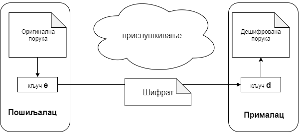
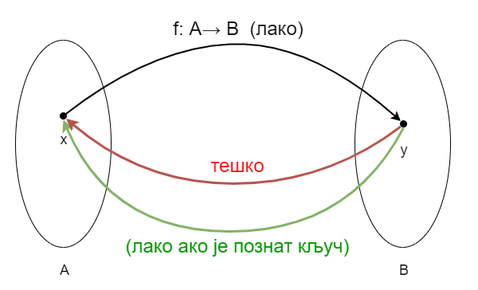
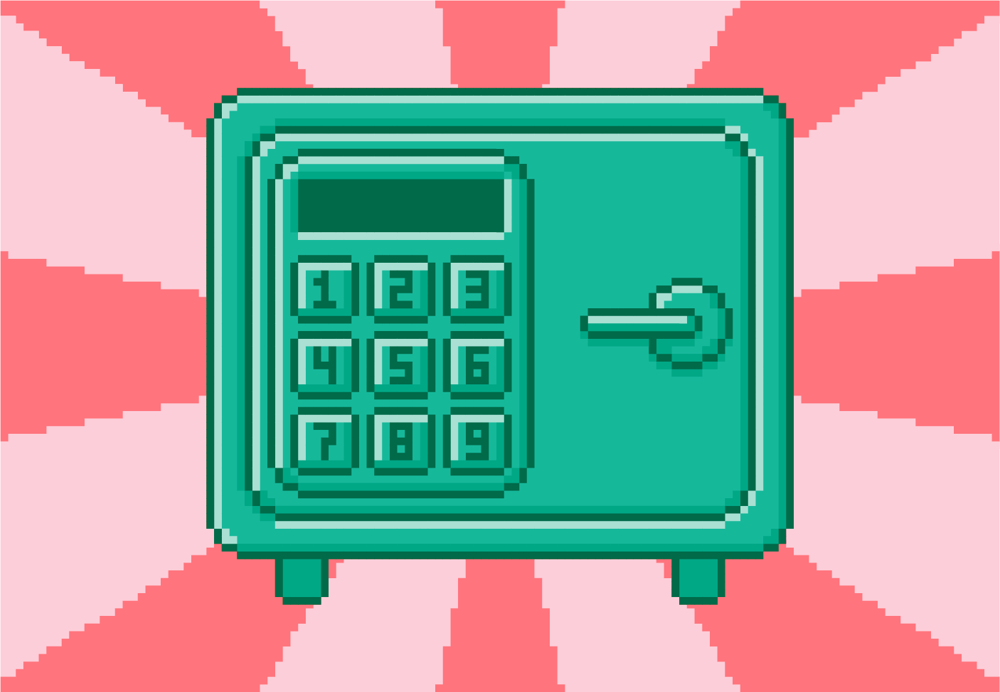

Криптографија
=============

Основни појмови
---------------

Криптографију за почетак можемо да дефиишемо као науку, која се бави методима очувања тајности 
информација. Потреба за записивањем порука тако да може да их прочита смо онај коме су намењене 
постоји скоро једнако дуго као и само писмо. Први масовно познати примери се односе на употребу 
криптографије у војне сврхе. Војсковође су међусобно размењивале поруке преко курира, али да план 
не би био откривен у случају да курура ухвати непријатељ, било је важно да непријатељ не може да 
протумачи поруку. Зато је било потребно да се порука пре слања криптује (шифрује) а да се по 
пријему декриптује (дешифрује). 

На пример, Гај Јулије Цезар је користио криптовање које се и данас зове по њему (Цезаров 
кôд), а које се састоји у томе да се свако слово поруке замени словом које је за неки унапред 
договорени број места даље у абецеди.
        
|

**Пример - Цезаров кôд**

Рецимо да је договор да се при криптовању поруке свако слово помера за три места у абецеди. 
У латинском језику су коришћена ова 23 слова: 
``A, B, C, D, E, F, G, H, I, K, L, M, N, O, P, Q, R, S, T, V, X, Y, Z``. Напишимо испод сваког 
од тих слова оно које се добија померањем за три места:

| ``A B C D E F G H I K L M N O P Q R S T V X Y Z``
| ``D E F G H I K L M N O P Q R S T V X Y Z A B C``

Видимо да се нпр. слово ``E`` криптовањем пресликава у слово ``H``, а слово ``Z`` у слово ``C``.
Нека је порука "EGO FLUMEN TRANSIRE" (прелазим реку). Криптовањем слово по слово, добили бисмо 
шифрат (криптовани текст) "HKR IOCPHQ YVDQXMVH". Овај шифрат можемо да декриптујемо померањем 
сваког слова за 20 места у абецеди (објасни зашто).

Испробајте криптовање ове, или неке друге поруке у следећем програму:

.. activecode:: cezarov_kod_program

    rimska_abededa = 'ABCDEFGHIKLMNOPQRSTVXYZ'
    br_slova = len(rimska_abededa)

    def kriptuj(poruka, pomeraj):
        sifrat = []
        for slovo in poruka:
            if slovo == ' ':
                sifrat.append(' ')
            else:
                poz = rimska_abededa.find(slovo)
                kriptovano_slovo = rimska_abededa[(poz+pomeraj) % br_slova]
                sifrat.append(kriptovano_slovo)
        return ''.join(sifrat)

    poruka = input('Унеси поруку великим словима: ')
    print('Шифрат је')
    print(kriptuj(poruka, 3))

.. topic:: Криптовање и кодирање
    
    Често се уместо речи криптовање и декриптовање (декрипција) користе познатије речи кодирање и 
    декодирање, мада оне данас имају нешто другачије значење. Наиме, кодирање више не подразумева 
    намеру да неки садржај учинимо читљивим само за одређене особе, него да тај садржај запишемо на 
    другачији начин, најчешће из техничких разлога. Тако на пример, да бисмо могли да чувамо текстове 
    и слике у рачунару, потребно је да те текстове и слике кодирамо помоћу бројева. На сличан начин 
    је некад коришћен Морзеов код, а данас користимо бар кодове на производима које купујемо, или QR 
    кодове, који нас најчешће воде ка одређеним веб странама. При томе су правила за кодирање и 
    декорирање у свим овим случајвема позната јавности и масовно коришћена.
    
У Цезарово време, када је ретко ко био и писмен, ово је било више него довољно да спречи непријатеља 
да прочита и разуме поруку. Данас би овакав начин криптовања био прилично наиван и могао би да послужи 
само као вежба за почетнике у разбијању шифре. Без обзира на то, овај пример ће нам послужити да 
поступак енкрипције сагледамо мало формалније.

|

**Криптовање као математичка функција** 

Криптовањем називамо поступак (алгоритам), којим се отворени текст пресликава (мапира) у нечитљив 
низ симбола, који називамо *шифрат*. У математици се уместо речи пресликавање или мапирање користи 
реч функција. Дакле, можемо да кажемо да је криптовање математичка функција :math:`F`, која 
пресликава отворени текст :math:`P` у шифрат :math:`C`, или кратко: :math:`F: P \to C`. Функција 
:math:`F` очигледно мора да буде бијекција, тј. обострано једнозначно ("1-1") пресликавање. Другим 
речима, функција мора да буде таква да сваки шифрат може једнозначно да се декриптује у полазни 
текст. Када тако посматрамо ствари, *декриптовање* није ништа друго него примена инверзне функције 
(инверзног пресликавања) :math:`F^{-1}`, које шифрат пресликава у полазни текст. Дакле, ако је 
:math:`F(P)=C`, онда :math:`F^{-1}(C)=P`.

|

**Појам кључа** 

Да би функција :math:`F` која криптује текст била тежа за откривање, она често користи један или више 
параметара. На пример, у криптовању Цезаровом шифром, функција користи померај слова за одређени број 
места. Тај број места је параметар поступка енкрипције, однсно функције :math:`F`. Ми смо у примеру 
користили вредност параметра 3. При слању следеће поруке параметар би могао да има вредност 5 или било 
коју другу вредност. Такве промене отежавају посао *криптоаналитичару*, који покушава да открије поступак 
декриптовања. Употреба параметра нам у неким случајевима омогућава да, чак и када је сам поступак 
енкрипције откривен, променом вредности параметара и даље обезбеђујемо тајност (о томе више касније).

У општем случају, у било ком поступку енкрипције података, вредност параметра енкрипције зовемо 
*кључ* и обично га означавамо словом :math:`e`. Поступак декрипције може да буде исти као код 
енкрипције, али са другом вредношћу параметра, а може да буде и сасвим другачији. У случају Цезарове 
шифре користи се исти поступак, само је вредност параметра-кључа једнака :math:`23-e`, јер је римска 
абецеда имала 23 слова. Вредност кључа који се користи у декрипцији (дешифровању) означавамо словом 
:math:`d`.

    Шематски приказ криптовања, слања и декриптовања поруке

Данас је уобичајено да се за енкрипцију и декрипцију користи исти поступак, а да се разликује само 
вредност кључа, а у неким применама ни то. Ако се при енкрипцији и декрипцији користи исти кључ, реч 
је о симетричној енкрипцији, а ако се користе различити кључеви, енкрипција је асиметрична. Предност 
симетричне енкрипције је њена једноставност, али проблем је достављање заједничког кључа другој страни. 
Наиме, ако би кључ био пресретнут, поступак би био компромитован и онај ко касније прислушкује или 
пресреће криптоване поруке, са лакоћом би могао да их декриптује. Зато се симетрична енкрипција више 
не користи толико у комуникацији, већ више за чување текста и других података у облику који није 
читљив другима.

Криптовање помоћу јавног кључа
------------------------------

Природно, први криптосистеми су држали у тајности и сам поступак криптовања и кључ за енкрипцију и 
декрипцију. Такви системи су подразумевали да само пошиљалац и прималац поруке знају и поступак 
енкрипције и декрипције, тј. функцију :math:`F`, и кључ који се тренутно користи. Овакве системе 
називамо системима са тајним кључем. Ако се за енкрипцију и декрипцију користи исти кључ, систем 
је симетричан.

Почетни кључ је могао да буде договорен раније, пре него што се пошиљалац и прималац раздвоје. Као 
што смо поменули, потенцијални проблем код оваквих криптосистема је што може да буде тешко да се 
нови кључ касније достави на безбедан начин. Ипак, овакви системи су дуго коришћени са доста успеха.
Познат је и обрнути пример из другог светског рата, када је британска обавештајна служба открила 
систем који су Немци користили за криптовање порука. Након откривања шифре, Британци су успешно 
пресретали и кључеве коришћене у каснијој комуникацији.

Овакви системи због своје природе нису били погодни за масовну упротребу, јер са повећавањем броја 
корисника било би практично немогуће очувати тајност поступка. Да би неки криптосистем могао да се 
користи масовно, било је потребно да се осмисли такав начин криптовања у коме ни сам поступак, а ни 
кључ за криптовање не би морали да буду тајни (свако може да шаље поруке). Одавде следи да за 
криптовање и декриптовање морају да се користе различити кључеви. Дакле, трагало се за криптосистемом 
са следећим особинама:

- постоје два различита кључа, један за криптовање, а други за декриптовање
- поступак криптовања/декриптовања и кључ за криптовање су јавно доступни
- кључ за декриптовање се чува у тајности и познат је само примаоцу порука
- поступак генерисања кључева треба да буде рачунски јефтин (да рачунар може брзо да га обави)
- поступак криптовања и декриптовања такође треба да буде рачунски јефтин
- поступак разбијања шифре (израчунавања кључа за декрипцију) треба да буде рачунски веома скуп, 
  тако да је рачунару за то потребно огромно време.

Суштина је у томе да функција криптовања :math:`F` треба да се релативно лако израчунава (кључ за 
криптовање је свима познат), а да израчунавање њој инверзне функције без познавања кључа за декрипцију 
затхева тако огромно време, да је практично неизводљиво. Функција са оваквом особином се у рачунарству 
назива **једносмерна функција** (енгл. one-way function). Ово не треба мешати са појмом "1-1" (обострано 
једнозначне) функције, тј. функције која има инверзну функцију.

    
    Једносмерна функција

Криптовање помоћу јавног кључа је слично закључавању и откључавању сефа са нумеричком комбинацијом. 
Свако може једноставно да закључа сеф, а откључавање је практично немогуће без познавања комбинације.

Сценарио употребе криптовања помоћу јавног кључа сада можемо сликовито да опишемо на следећи начин. 
Организатор криптосистема направи велики број оваквих сефова и подели их бесплатно. Свако може да 
користи сеф тако што стави поруку у њега, закључа сеф и пошаље га организатору система. Ако би неко 
и пресрео овакву пошишљку, било би му потребно веома много времена да дође до поруке и прочита је. 
Са друге стране, организатор система зна комбинацију која отвара сеф и лако долази до поруке.

Један систем са овим особинама је осмишљен 1977. године, а у наредним деценијама је постао веома 
познат и масовно коришћен. Реч је о чувеном алгоритму RSA, који је добио име по иницијалима својих 
аутора (RSA - Rivest, Shamir, Adleman).

Формално гледано, сваки алгоритам можемо да схватимо као математичку функцију која пресликава улазне 
податке у излазне. У том смислу, и алгоритам RSA је математичка функција која користи неки кључ :math:`k` 
као параметар, а пресликава улаз :math:`X` у излаз :math:`Y`, то јест :math:`Y = RSA(k, X) = RSA_k(X)`.

Када неко жели да пошаље поруку :math:`P` криптовану овим алгоритмом, треба да примени алгоритам RSA 
са јавно доступним кључем :math:`e` као параметром и тако добије шифрат :math:`C=F(P)=RSA(e, P)=RSA_e(P)`. 
Када криптована порука :math:`C` стигне до примаоца, он је декриптује истим алгоритмом, али користећи 
приватни кључ :math:`d` који је доступан само њему и добија полазну поруку 
:math:`P=F^{-1}(C)=RSA(d, C)=RSA_d(C)`.

Пошто је алгоритам RSA познат и јавно доступан, можда сте помислилии да би нападач могао на основу 
такође јавно доступног и познатог кључа :math:`e` да израчуна приватни кључ :math:`d`, тако 
да пресликавање :math:`RSA_d` буде инверзно пресликавању :math:`RSA_e`. Упркос томе што је познат 
чак и математички поступак израчунавања тајног кључа :math:`d`, нападач ипак не може да спроведе тај 
поступак. У наставку можете да прочитате зашто је то тако.
