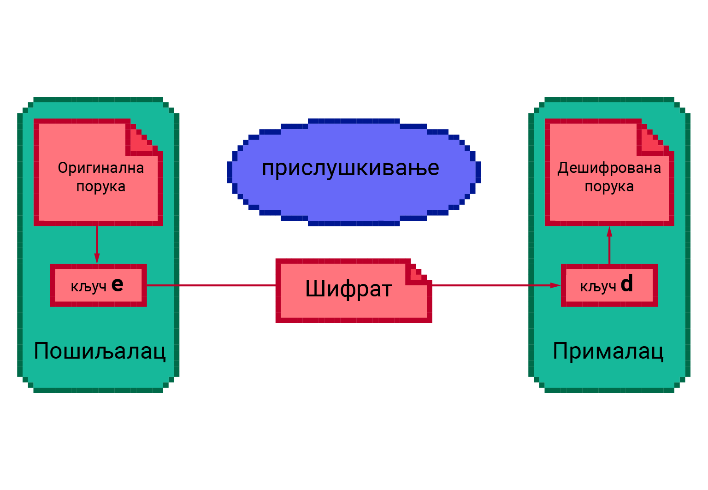

Криптографија - основни појмови
===============================

Криптографију за почетак можемо да дефинишемо као науку, која се бави методима очувања тајности 
информација. Потреба за записивањем порука тако да може да их прочита само онај коме су намењене 
постоји скоро једнако дуго као и само писмо. Први масовно познати примери се односе на употребу 
криптографије у војне сврхе. Војсковође су међусобно размењивале поруке преко курира, али да план 
не би био откривен у случају да курира ухвати непријатељ, било је важно да непријатељ не може да 
протумачи поруку. Зато је било потребно да се порука пре слања криптује (шифрује) а да се по 
пријему декриптује (дешифрује). 

На пример, Гај Јулије Цезар је користио криптовање које се и данас зове по њему (Цезаров 
кôд), а које се састоји у томе да се свако слово поруке замени словом које је за неки унапред 
договорени број места даље у абецеди.
        
|

**Пример - Цезаров кôд**

Рецимо да је договор да се при криптовању поруке свако слово помера за три места у абецеди. 
У латинском језику су коришћена ова 23 слова: 
``A, B, C, D, E, F, G, H, I, K, L, M, N, O, P, Q, R, S, T, V, X, Y, Z``. Напишимо испод сваког 
од тих слова оно које се добија померањем за три места:

| ``A B C D E F G H I K L M N O P Q R S T V X Y Z``
| ``D E F G H I K L M N O P Q R S T V X Y Z A B C``

Видимо да се нпр. слово ``E`` криптовањем пресликава у слово ``H``, а слово ``Z`` у слово ``C``.
Нека је порука „EGO FLUMEN TRANSIRE“ (прелазим реку). Криптовањем слово по слово, добили бисмо 
шифрат (криптовани текст) „HKR IOCPHQ YVDQXMVH“. Овај шифрат можемо да декриптујемо померањем 
сваког слова за 20 места у абецеди (објасни зашто).

Испробајте криптовање ове, или неке друге поруке у следећем програму:

.. activecode:: cezarov_kod_program

    rimska_abeceda = 'ABCDEFGHIKLMNOPQRSTVXYZ'
    br_slova = len(rimska_abeceda)

    def kriptuj(poruka, pomeraj):
        sifrat = []
        for slovo in poruka:
            if slovo == ' ':
                sifrat.append(' ')
            else:
                poz = rimska_abeceda.find(slovo)
                kriptovano_slovo = rimska_abeceda[(poz+pomeraj) % br_slova]
                sifrat.append(kriptovano_slovo)
        return ''.join(sifrat)

    poruka = input('Унеси поруку великим словима: ')
    print('Шифрат је')
    print(kriptuj(poruka, 3))

.. infonote:: 

    Криптовање и кодирање
    
    Често се уместо речи криптовање и декриптовање (декрипција) користе познатије речи кодирање и 
    декодирање, мада оне данас имају нешто другачије значење. Наиме, кодирање више не подразумева 
    намеру да неки садржај учинимо читљивим само за одређене особе, него намеру да тај садржај запишемо на 
    другачији начин, најчешће из техничких разлога. Тако на пример, да бисмо могли да чувамо текстове 
    и слике у рачунару, потребно је да те текстове и слике кодирамо помоћу бројева. На сличан начин 
    је некад коришћен Морзеов кôд, а данас користимо бар-кодове на производима које купујемо, или QR 
    кодове, који нас најчешће воде ка одређеним веб-странама. При томе су правила за кодирање и 
    декодирање у свим овим случајевема позната јавности и масовно коришћена.
    
У Цезарово време, када је ретко ко и био и писмен, ово је било више него довољно да спречи непријатеља 
да прочита и разуме поруку. Данас би овакав начин криптовања био прилично наиван и могао би да послужи 
само као вежба за почетнике у разбијању шифре. Без обзира на то, овај пример ће нам послужити да 
поступак енкрипције сагледамо мало формалније.

|

**Криптовање као математичка функција** 

Криптовањем називамо поступак (алгоритам), којим се отворени текст пресликава (мапира) у нечитљив 
низ симбола, који називамо *шифрат*. У математици се уместо речи „пресликавање“ или „мапирање“ користи 
реч „функција“. Дакле, можемо да кажемо да је криптовање математичка функција :math:`F`, која 
пресликава отворени текст :math:`P` у шифрат :math:`C`, или кратко: :math:`F: P \to C`. Функција 
:math:`F` очигледно мора да буде бијекција, тј. обострано једнозначно („1-1“) пресликавање. Другим 
речима, функција мора да буде таква да сваки шифрат може једнозначно да се декриптује у полазни 
текст. Када тако посматрамо ствари, *декриптовање* није ништа друго него примена инверзне функције 
(инверзног пресликавања) :math:`F^{-1}`, које шифрат пресликава у полазни текст. Дакле, ако је 
:math:`F(P)=C`, онда :math:`F^{-1}(C)=P`.

|

**Појам кључа** 

Да би функција :math:`F` која криптује текст била тежа за откривање, она често користи један или више 
параметара. На пример, у криптовању Цезаровом шифром, функција користи померање слова за одређени број 
места. Тај број места је параметар поступка енкрипције, односно функције :math:`F`. Ми смо у примеру 
користили вредност параметра 3. При слању следеће поруке параметар би могао да има вредност 5, или било 
коју другу вредност. Такве промене отежавају посао *криптоаналитичару*, који покушава да открије поступак 
декриптовања. Употреба параметра нам у неким случајевима омогућава да, чак и када је сам поступак 
енкрипције откривен, променом вредности параметара и даље обезбеђујемо тајност (о томе више касније).

У општем случају, у било ком поступку енкрипције података, вредност параметра енкрипције зовемо 
*кључ* и обично га означавамо словом :math:`e`. Поступак декрипције може да буде исти као код 
енкрипције, али са другом вредношћу параметра, а може да буде и сасвим другачији. У случају Цезарове 
шифре користи се исти поступак, само је вредност параметра-кључа једнака :math:`23-e`, јер је римска 
абецеда имала 23 слова. Вредност кључа који се користи у декрипцији (дешифровању) означавамо словом 
:math:`d`.

    Шематски приказ криптовања, слања и декриптовања поруке

Данас је уобичајено да се за енкрипцију и декрипцију користи исти поступак, а да се разликује само 
вредност кључа, а у неким применама ни то. Ако се при енкрипцији и декрипцији користи исти кључ, реч 
је о симетричној енкрипцији, а ако се користе различити кључеви, енкрипција је асиметрична. Предност 
симетричне енкрипције је њена једноставност, али проблем је достављање заједничког кључа другој страни. 
Наиме, ако би кључ био пресретнут, поступак би био компромитован и онај ко касније прислушкује или 
пресреће криптоване поруке, са лакоћом би могао да их декриптује. Зато се симетрична енкрипција више 
не користи толико у комуникацији, већ више за чување текста и других података у облику који није 
читљив другима.
