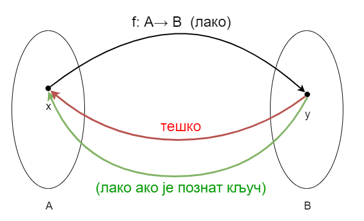

Проблем веродостојности и аутентичности поруке
==============================================

Као што смо видели, криптовање помоћу јавног кључа (ако се правлино имплементира) задовољава потребе 
тајности података. Конкретније, када организујемо криптовање помоћу јавног кључа, можемо од било кога 
да примамо криптоване поруке, које нико други не може да декриптује (ако нема приватни кључ).
Међутим, на овај начин не можемо да гарантујемо веродостојност (интегритет) порука. Пошто је поступак 
криптовања јаван, свако може да пошаље поруку криптовану јавним кључем, па не можемо да знамо од кога 
порука стиже, а самим тим ни да ли је је то порука коју очекујемо, или подметнута порука.

Да би се гарантовала веродостојност поруке, користи се **дигитални потпис**. Правилно креиран 
дигитални потпис даје примаоцу веома јак разлог да верује да је поруку креирао познати пошиљалац 
(аутентификација) и да порука није промењена током преноса (веродостојност). Дакле, дигитални потпис је 
механизам аутентификације, који омогућава креатору поруке да приложи кôд који служи као потпис. 

Дигитални потпис помоћу криптовања јавним кључем
------------------------------------------------

Један начин да се креира дигитални потпис је помоћу криптовања јавним кључем, али је размену потребно 
организовати мало другачије него што смо то до сада радили. овај пут, свако ко жели да шаље поруке, 
треба да креира свој пар кључева, приватни и јавни. Наравно, приватни кључ задржава у тајности, а јавни 
кључ може јавно да огласи.

Да бисмо разумели како криптовање помоћу јавног кључа функционише у овом случају хајде да се прво подсетимо
особина функције криптовања. Видели смо да када на поруку :math:`M` применимо поступак криптовања :math:`F`, 
добијамо криптовану поруку (шифрат) :math:`C = F(M)`, а када на криптовану поруку :math:`C` применимо 
поступак декриптовања :math:`F^{-1}`, поново добијамо полазну поруку :math:`M = F^{-1}(C)`.

Пошто су поступци криптовања :math:`F` и декриптовања :math:`F^{-1}` један другом инверзни, можемо да 
их применимо и у обрнутом редоследу. Означимо :math:`F^{-1}(M)`  са :math:`S`. Порука :math:`S` је 
криптована приватним кључем и није директно читљива, али свако може да је декриптује јавним кључем 
и добије изворну поруку :math:`M`. У овом случају нема тајности, али овако измењеним поступком 
комуникације можемо да обезбедимо аутентичност (зна се да је поруку могао да пошаље само онај ко има 
приватни кључ) и веродостојност (нико није могао да измени поруку, ако нема приватни кључ).

И у овом и у претходном начину употребе криптовања помоћу јавног кључа, ослањамо се на особину функције 
криптовања :math:`F` да се она лако израчунава, а израчунавање њој инверзне функције затхева тако 
огромно време, да је практично неизводљиво. Ово је слично закључавању и откључавању сефа са нумеричком 
комбинацијом. Закључавање је једноставно (само се заврте бројчаници), а откључавање је практично 
немогуће без познавања комбинације која откључава сеф.

Функција са оваквом особином се у рачунарству назива једносмерна функција (енгл. one-way function).
Ово не треба мешати са појмом "1-1" (обострано једнозначне) функције, тј. функције која има инверзну
функцију.

Данас постоје и многи други, савременији начини организовања дигиталног потписа, али се сви они 
заснивају на некој једносмерној функцији. Сваки поступак креирања дигиталног потписа у принципу обухвата 
следећа три алгоритма:

- Алгоритам за генерисање кључева, који насумично (са униформном расподелом) бира приватни кључ из
  скупа могућих приватних кључева. Алгоритам даје приватни кључ и одговарајући јавни кључ.
- Алгоритам за потписивање који, за дату поруку и приватни кључ, производи потпис.
- Алгоритам за верификацију потписа који, за дату поруку, јавни кључ и потпис, или прихвата или одбија 
  тврдњу о аутентичности поруке.

Хеш функције
------------

Хеш функцију можемо да дефинишемо као пресликавање низа битова произвољне дужине у неки знатно мањи 
скуп вредности. При томе је пожељно да мале промене улаза изазивају велике промене резултата. 

Употреба хеш функција у откривању грешака
'''''''''''''''''''''''''''''''''''''''''

Прве примене хеш функција нису имале везе са криптографијом. Једна њихова примена односи се на лакше 
откривање случајних грешака током преноса или чувања података (због несавршености преноса, одноно 
медијума на коме се чувају подаци). 

Један пример овакве употребе хеширања су матични беојеви грађана у Србији (ЈМБГ). Матични број се 
састоји од 13 цифара. При томе првих 12 цифара (између осталог) носе информације о датуму и месту 
рођења особе, док се тринаеста цифра израчунава на основу првих 12 и служи као контролна цифра.  
Поступак израчунавања изгледа овако:

.. activecode:: jmbg_cifra13

    a = list(map(int, input('Унесите првих 12 цифара матичног броја')))
    f = ((11 - sum((7-i)*(a[i] + a[i+6]) for i in range(6))) % 11) % 10
    print('Тринаеста цифра је', f)

Можемо да кажемо да је тринаеста цифра вредност хеш функције, примењене на првих дванаест цифара.
Поступак рачунања тринаесте цифре је тако дизајниран да при малим променама у првих 12 цифара (нпр. 
пермутовање две суседне цифре, промена вредности само једне цифре и слично), долази до промене у 
тринаестој цифри. То значи да типичне омашке настале приликом преписивања матичног броја могу да се
открију рачунски. довољно је да се након преноса (преписивања) тринаестоцифреног броја поново израчуна
тринаеста цифра на основу првих 12. Ако се она не поклапа са преписаном тринаестом цифром, дошло је 
до грешке у преписивању. Теоријски је могуће да се при преписивању погреши на такав начин да се добије 
иста тринаеста цифра, али шансе да се то догоди су веома, веома мале (таква грешка би тешко могла 
да се догоди случајно).

Врло сличан поступак се користи при сваком преносу података рачунаром. Сваком блоку података се 
придружује мала контролна вредност, која се израчунава на основу података из основног блока. Тиме се 
омогућава откривање случајних промена (грешака) у подацима, насталих током чувања или преноса.
Овај поступак је познат под скраћеницом *CRC* (енгл. cyclic redundancy check), а конторлна вредност 
која се дописује блоковима податка се назива *CRC* вредност. Бројне варијанте *CRC* провера су уграђене 
у разне техничке стандарде.

Употреба хеш функција у имплементацији структура података
'''''''''''''''''''''''''''''''''''''''''''''''''''''''''

Још једна важна примена хеш функција је имплементација структура података као што су скуп и речник 
у модерним програмским језицма или њиховим стандардним библиотекама. Без улажења у детаље, објанићемо 
основе на примеру скупа у програмском језику Пајтон. 

Основна предност скупа над листом је што се провера припадности неког елемента скупу обавља много 
брже него припадност листи. У случају листе би било потребно да се испитује један по један њен 
елемент. На који начин се та провера у скуповима дешава много брже? Нека нам је позната хеш функција 
која елементе скупа пресликава у целе бројеве од 0 до :math:`N`, где је :math:`N` приближно једнако 
величини скупа. Претпоставимо за тренутак да хеш функција пресликава различите елементе скупа у 
различите целе бројеве. Тада би за смештање елемената скупа могла да се искористи нека интерна листа. 
При томе би се сваки елемент налазио на оној позицији у листи која одговара хеш вредности тог елемента. 
Када желимо да проверимо да ли се елемент налази у скупу, поступак уграђен у Пајтон интерпретер 
израчунава хеш вредност тог елемента, и користи га као индекс у интерној листи. Ако се елемент не 
налази на одговарајућем месту у листи, онда он није у скупу и нема потребе да се тражи на другим 
местима. 

Остаје нам случај када хеш функција различитим елементима придружује исту хеш вредност. Такав случај 
се назива **колизија**. На овом месту се не можемо бавити разешавањем колизија, али ћемо напоменути да 
су оне за хеш функцију непожељне и да њихово разрешавање компликује имплементацију скупова и речника, 
а мало и успорава њихову употребу. 

Хеш функције у криптографији
----------------------------

Хеш функције које се користе у криптографији су сличне онима које смо до сада описали. Разлика је 
у томе што се од криптографске хеш функције очекује да издржи све познате врсте криптоаналитичких 
напада. То значи да сама функција мора да се бира (дизајнира) знатно пажљивије, да би њена употреба 
била безбедна, с обзиром на намену. У теоријској криптографији, ниво безбедности криптографске хеш 
функције описује се следећим особинама:

- Отпорност на нападе са познатом сликом (енгл. pre-image resistance): За дату хеш вредност :math:`h`, 
  треба да буде тешко да се пронађе било која порука :math:`M`, таква да је :math:`h = hash(M)` (тј. 
  хеш функција треба да је једносмерна). Функције којима недостаје ово својство су рањиве нападима 
  са познатом сликом.
- Отпорност на нападе са познатом другом сликом (енгл. second pre-image resistance): За дату поруку 
  :math:`M_1`, треба да буде тешко да се пронађе другачији улаз :math:`M_2`, такав да је 
  :math:`hash(M_1)=hash(M_2)`. Ово својство се понекад назива слабом отпорношћу на колизије. Функције 
  којима недостаје ово својство су рањиве нападима са познатом другом сликом.
- Отпорност на колизије (енгл. collision resistance): Треба да буде тешко да се пронађу две различите 
  поруке :math:`M_1` и :math:`M_2`, такве да је :math:`hash(M_1)=hash(M_2)`. Такав пар се назива 
  криптографска хеш колизија. Ово својство се понекад назива јака отпорност на колизије. Оно захтева 
  најмање двоструко дужу хеш вредност од оне која је потребна за отпорност на нападе са познатом 
  сликом. У супротном, колизије могу да буду пронађене такозваним рођенданским нападом 
  (енгл. `birthday attack <https://en.wikipedia.org/wiki/Birthday_attack>`_).

Неформално, ова својства значе да нападач не може да замени или измени улазне податке без промене 
њихове хеш вредности. Дакле, ако две поруке имају исту хеш вредност, можемо бити практично сигурни 
да су то идентичне поруке. 

Отпорност на нападе са познатом другом сликом спречава нападача да направи документ са истим хешом као 
оригинални документ. Отпорност на колизију спречава нападача да креира два различита документа са истим 
хешом.

Функција отпорна на колизије је уједно отпорна на нападе са познатом другом сликом, али не мора да 
буде отпорна на нападе са познатом сликом. Било би пожељно да се не намећу тако јаки услови за хеш 
функције, али у пракси се хеш-функција која је отпорна само на нападе са познатом другом сликом сматра 
несигурном и стога се не препоручује за стварне примене.

Набрoјане особине су само неки од услова које очекујемо да хеш функција испуни. У ствари, функција која 
испуњава ове критеријуме и даље може да има непожељна својства.

Поред отпорности на колизије, нападачу треба да буде практично немогуће да пронађе две поруке са 
суштински сличним хешом, или да закључи било коју корисну информацију о подацима, ако му је доступан 
само њихов хеш. Конкретно, хеш функција треба да се понаша колико год је то могуће као насумична 
функција, док је и даље детерминистичка (сваки пут даје исти резултат) и ефикасно се израчунава. 

*CRC* алгоритми контролне суме, као што је *CRC32*, дизајнирани су да задовоље много слабије захтеве 
и генерално су неприкладни као криптографске хеш функције. Пошто је контролна сумна линеарна функција, 
постоји велика правилност у њеним вредностима (нема потребне случајности), па у случају да се она 
упортеби као криптографски хеш, постаје лака мета нападача.

Неке познате функције које се користе као криптографске хеш функције су *MD5* (MD5 - message digest 
algorithm), *SHA-1* и *SHA-2* (SHA - Secure Hash Algorithm, чита се: ша).

Примене хеш функција
''''''''''''''''''''

**Провера веродостојности порука и фајлова**

Употреба хеш функција је данас широко распрострањен начин гарантовања веродостојности података. 
Претпоставимо да је неко омогућио преузимање великог фајла, нпр. инсталацију неког софтвера. Чест 
је случај да се исти пакет постави и на другим сајтовима, да би се растереито оригинални сервер. 
Разумљиво, поставља се питање како можемо да будемо сигурни да је пакет преузет са такозваног 
сајта-огледала (енгл. mirror site) истоветан пакету са оригиналног сајта. Један начин да се то 
гарантује је да се на оригиналном сајту објави вредност хеш функције читавог пакета (аутентификовану 
преко протокола *HTTPS*). Свако ко преузме пакет са другог сајта, може сам да израчуна хеш функцију 
тог пакета (помоћу стандардног програма) и упореди је са вредношћу објављеном на оригиналном сајту. 
Практично је неизводљиво да нападач измени пакет, а да вредност хеш функције остане иста. За хеш 
функцију која приозводи 256-битне вредност, шаснсе да се то случајно догоди су :math:`1 \over 2^{256}`, 
што је приближно једном у :math:`10^{77}` случајева (практично никад). 

**Генерисање и верификација дигиталног потписа**

Дигитални потпис се најчешће израчунава знатно спорије него криптографска хеш функција. Зато 
скоро све шеме дигиталног потписа захтевају да се над поруком израчуна криптографски хеш, а затим 
да се дигитални потпис израчуна само на тој хеш вредности, која је по правилу много мања од поруке. 

Приликом верификације потписа, потребно је да израчунамо хеш вредност поруке и да је упоредимо 
са декриптованом вредношћу потписа (потпис се декриптује јавним кључем). Ако се те две вредности 
поклапају, потпис се прихвата као аутентичан.

**Верификација лозинке**

Чување свих корисничких лозинки у облику отвореног текста може да доведе до великог нарушавања 
безбедности ако се фајл са лозинкама компромитује, тј. "процури". Један од начина да се смањи 
ова опасност је да се чува само хеш вредност сваке лозинке. Да би се аутентификовао корисник, 
лозинка коју корисник унесе се хешира и упоређује се са сачуваним хешом. Кориснику који заборави 
лозинку омогућава се да зада нову (тј. да ресетује лозинку), јер се оригинална лозинка не може 
поново израчунати на основу сачуване хеш вредности.

Као што је речено, стандардне криптографске хеш функције су дизајниране тако да се брзо израчунавају.
Због тога је могуће да се нагађањем испроба огроман број лозинки за кратко време. Уобичајене графичке 
карте могу да испробају милијарде могућих лозинки сваке секунде. Зато неке функције хеширања лозинке 
врше тзв. проширење кључа, односно продужавају саму лозинку, или време поребно за израчунавање хеша, 
и тиме отежавају посао нападачу који грубом силом покушава да погоди лозинку. 

**Доказ о раду**

Доказ о раду је систем (протокол, функција) за одвраћање нападача који покушава да изазове ускраћивање
услуге (енгл. denial of service) због преоптерећености сервера. као и за одвраћање од неких сличних 
злоупотреба услуга. Овај систем функционише тако што захтева неки рад од подносиоца захтева за услугу, 
а то обично значи да рачунар подносиоца мора да проведе неко време обрађујући податке. Кључна 
карактеристика ових шема је њихова асиметрија: посао мора бити умерено тежак (али изводљив) на страни 
подносиоца захтева, али лако проверљив за пружаоца услуга. Један популаран систем, који се користи у 
рударењу биткоина и ограничавању слања електронске поште функционише тако што се од корисника тражи да 
пронађе неку поруку, чија хеш вредност почиње одређеним бројем нула битова. Просечан посао који пошиљалац 
треба да обави да би пронашао прихватљиву поруку је експоненцијална функција броја нула потребних на 
почетку хеш вредности, док прималац може да провери валидност поруке рачунањем само једне хеш функције 
(над примљеном поруком). 
