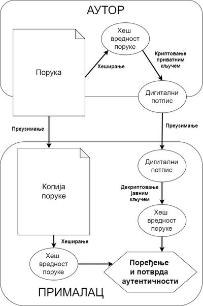

Примене криптографије данас
===========================

Задаци модерне криптографије
----------------------------

Током векова, криптографија је напредовала као наука, нарочито са развојем математике, а током 
последњих неколико деценија и рачунарства. Методе које се користе у криптографији су постале 
много напредније, а њена примена је ушла у многе области људског деловања. Криптографија одавно 
није тема само војних, безбедносних и дипломатских служби, она се широко примењује у електронском 
пословању, финансијама, трговини итд. Чак и појединци могу да искористе криптографију за личне 
потребе, нпр. тако што при архивирању података поставе лозинку на архиву.

У савременом друштву, од криптографије се више не очекује само да обезбеди тајност информација, јер 
је у међувремену уочено да криптографија може врло корисно да послужи и у друге сврхе. 

Најважнији задаци савремене криптографије су да обезбеди:

- Тајност информација (енгл. *confidentiality* - поверљивост, тајност) 
- Веродостојност информација (енгл. *data integrity* - интегритет, веродостојност података)
- Проверу идентитета (енгл. autentification)
- Немогућност избегавања одговорности (енгл: *non-repudiation* - непорицање) 

**Обезбеђивање тајности** информација значи да је садржај информације доступан само овлашћеним лицима, 
односно само онима који поседују кључ за декрипцију. Да би се криптосистем сматрао безбедним, важно 
је да нападач (криптоаналитичар) не може да декриптује информације без кључа. Криптографија обезбеђује 
тајност помоћу различитих математичких алгоритама, а један од њихј је алгоритам RSA.

**Да би се обезбедила веродостојност** информација које се криптују, треба спречити да дође до 
неовлашћене промене информација (преправљање, брисање дела, или подметање друге информације). Другим 
речима, потребно је да постоји начин да се провери да ли је информација промењена након њеног 
настанка. И ово се постиже одређеним алгоритмима, које ћемо ускоро описати.

**Провера идентитета** подразумева да учесници у комуникацији треба да докажу свој идентитет (да 
се представе на проверљив начин) пре него што започну размену информација.

**Немогућност избегавања одговорности** се састоји у томе да лице које да пристанак на нешто (нпр. 
изда чек или потпише уговор) не може касније да порекне свој пристанак, тврдећи да је у питању 
фалсификат. Један од начина да се помоћу криптографије обезбеди непорицање је употреба дигиталног 
потписа, о чему ће ускоро бити речи.

Потврђивање аутентичности помоћу RSA
------------------------------------
    
Као што смо видели, криптовање помоћу јавног кључа (ако се правлино имплементира) задовољава потребе 
тајности података. Конкретније, када организујемо криптовање помоћу јавног кључа, можемо од било кога 
да примамо криптоване поруке, које нико други не може да декриптује (ако нема приватни кључ).
Међутим, на овај начин не можемо да гарантујемо веродостојност (интегритет) порука. Пошто је поступак 
криптовања јаван, свако може да пошаље поруку криптовану јавним кључем, па не можемо да знамо од кога 
порука стиже, а самим тим ни да ли је то порука коју очекујемо, или подметнута порука.

Захваљујући особинама алгоритма RSA (и сличних криптосистема са јавним кључем), проблем веродостојности 
порука може у начелу да се реши веома једноставно. Пошто су :math:`RSA_e` и :math:`RSA_d` једна другој 
инверзне функције, оне могу да буду примењене на неку поруку и обрнутим редом (тј. прво приватни кључ, 
а затим јавни), а да се после примене оба кључа поново добије полазна порука. Одавде следи да је за 
обезбеђивање веродостојности довољно да се RSA криптосистем организује тако **да пошиљалац порука има 
приватни кључ, а сви примаоци да имају јавни кључ**. У овом случају, пошиљалац криптује поруку :math:`P` 
приватним кључем и ствара криптовану поруку :math:`S = RSA_d(P)`, а затим примаоци јавним кључем 
декриптују објављену криптовану поруку и добијају полазну поруку :math:`P = RSA_e(S)`. Када се алгоритам 
RSA примени на овакав начин, послата порука није тајна јер свако може да је декриптује, али то није ни 
била намера. У овако измењеном поступку комуникације, примаоци се служе декриптовањем искључиво зато да 
би се уверили да порука заиста долази од власника приватног кључа, јер знају да је поруку тако могао да 
криптује само онај ко поседује приватни кључ. 

Наведени механизам размене информација може да се употреби и за утврђивање идентитета. Слањем поруке на 
овај начин, пошиљалац потврђује да поседује одговарајући приватни кључ, чиме је доказао свој идентитет, 
тј. "показао је личну карту". Сличан начин потврђивања идентитета често се користи у алгоритмима разних 
мрежних протокола, као потврда да је друга страна она са којом смо и желели да успоставимо комуникацију, 
а не неко ко се злонамерно убацује у комуникацију и лажно представља.

Немогућност порицања се у суштини такође своди на доказ идентитета, а разлика је само у друштвеном 
контексту. У случају спорне аутентичности поруке, пошиљалац се позива на механизам размене да увери све 
примаоце да је поруку заиста послао он. Код немогућности порицања прималац је тај који се позива на 
механизам размене као доказ да је поруку послао баш дотични пошиљалац, тако да пошиљалац не може то да 
порекне, чак и ако би хтео.

Потврђивање аутентичности помоћу хеш функција
---------------------------------------------

Проблем са претходно описаним начином потврђивања идентитета је у томе што алгоритам RSA није погодан 
за примену на дугачким порукама. На пример, ако желимо да некоме пошаљемо фајл који је дугачак више 
десетина мегабајта, директна примена претходно описаног поступка би подразумевала да се цео фајл 
криптује одговарајућим приватним кључем. Као што је раније описано, алгоритам RSA над сваким делићем 
поруке обавља рачунске операције са огромним бројевима, што је релативно споро у односу на друге 
поступке који се уобичајено примењују над дугачким низовима податка (наравно, поступак разбијања 
шифре алгоритма RSA је далеко, далеко спорији и реално неизводљив, па те две спорости не треба мешати).

Потврђивање идентитета или веродостојности порука се веома интензивно користи у данашњој комуникацији. 
Да бисмо до тога стигли, био је потребан ефикаснији поступак који би имао приближно исте особине као 
наведени. Идеја до које се дошло је да се на основу дугачке поруке (нпр. фајла) бржим поступком креира 
нека знатно краћа порука, а да се затим криптује само та краћа порука. При томе поступак скраћивања 
поруке треба да буде такав, да је веома, тешко (у пракси неизводљиво) да се нађе друга полазна порука 
која има исту скраћену верзију, или да се уопште нађу две поруке са истом скраћеном верзијом, јер би 
то обесмислило идеју скраћивања поруке. 

Поступци са приближно таквим особинама развијени су и употребљавани и пре него што се јавила потреба 
за њима у криптографији, а познати су под именом хеширање, односно примена **хеш функција**. 

Хеш функцију можемо да дефинишемо управо као пресликавање низа битова произвољне дужине у неки 
знатно мањи скуп вредности, односно краћи низ битова. У пракси је резултат хеш функције врло често 
фиксне дужине, нпр. 256 бита (или само једна декадна цифра), што умногоме олакшава њихову употребу. 
Зато се понегде и та особина наводи као део дефиниције хеш функције.

Пре употребе у криптографији, хеш функције су се типично користиле за откривање случајних грешака током 
преноса или чувања података (због несавршености преноса, односно медијума на коме се чувају подаци), као 
и за имплементацију структура података попут скупова и речника у модерним програмским језицма или 
њиховим стандардним библиотекама. 

.. reveal:: hash_funkcije
    :showtitle: О другим применама хеш функција
    :hidetitle: Сакриј текст о другим применама хеш функција

    |
    
    **Примена хеш функција у откривању грешака**
   

    Прве примене хеш функција нису имале везе са криптографијом. Једна њихова примена односи се на лакше 
    откривање случајних грешака током преноса или чувања података (због несавршености преноса, односно 
    медијума на коме се чувају подаци). 

    Један пример овакве употребе хеширања су матични бројеви грађана у Србији (ЈМБГ). Матични број се 
    састоји од 13 цифара. При томе првих 12 цифара (између осталог) носе информације о датуму и месту 
    рођења особе, док се тринаеста цифра израчунава на основу првих 12 и служи као контролна цифра.  
    Поступак израчунавања изгледа овако:

    .. activecode:: jmbg_cifra13

        a = list(map(int, input('Унесите првих 12 цифара матичног броја')))
        f = ((11 - sum((7-i)*(a[i] + a[i+6]) for i in range(6))) % 11) % 10
        print('Тринаеста цифра је', f)

    Можемо да кажемо да је тринаеста цифра вредност хеш функције, примењене на првих дванаест цифара.
    Поступак рачунања тринаесте цифре је тако дизајниран да при малим променама у првих 12 цифара (нпр. 
    пермутовање две суседне цифре, промена вредности само једне цифре и слично), долази до промене у 
    тринаестој цифри. То значи да типичне омашке настале приликом преписивања матичног броја могу да се
    открију рачунски. Довољно је да се након преноса (преписивања) тринаестоцифреног броја поново израчуна
    тринаеста цифра на основу првих 12. Ако се она не поклапа са преписаном тринаестом цифром, дошло је 
    до грешке у преписивању. Теоријски је могуће да се при преписивању погреши на такав начин да се добије 
    иста тринаеста цифра, али шансе да се то догоди су веома, веома мале (таква грешка би тешко могла 
    да се догоди случајно).

    Врло сличан поступак се користи при сваком преносу података рачунаром. Сваком блоку података се 
    придружује мала контролна вредност, која се израчунава на основу података из основног блока. Тиме се 
    омогућава откривање случајних промена (грешака) у подацима, насталих током чувања или преноса.
    Овај поступак је познат под скраћеницом `CRC <https://en.wikipedia.org/wiki/Cyclic_redundancy_check>`_ 
    (енгл. cyclic redundancy check), а конторлна вредност која се дописује блоковима податка се назива 
    *CRC* вредност. Бројне варијанте *CRC* провера су уграђене у разне техничке стандарде.

    **Употреба хеш функција у имплементацији структура података**

    Још једна важна примена хеш функција је имплементација структура података као што су скуп и речник 
    у модерним програмским језицма или њиховим стандардним библиотекама. Без улажења у детаље, објаснићемо 
    основе на примеру скупа у програмском језику Пајтон. 

    Основна предност скупа над листом је што се провера припадности неког елемента скупу обавља много 
    брже него припадност листи. У случају листе би било потребно да се испитује један по један њен 
    елемент. На који начин се та провера у скуповима дешава много брже? Нека нам је позната хеш функција 
    која елементе скупа пресликава у целе бројеве од 0 до :math:`N`, где је :math:`N` приближно једнако 
    величини скупа. Претпоставимо за тренутак да хеш функција пресликава различите елементе скупа у 
    различите целе бројеве. Тада би за смештање елемената скупа могла да се искористи нека 
    `интерна листа <https://en.wikipedia.org/wiki/Hash_table>`_. При томе би се сваки елемент налазио 
    на оној позицији у листи која одговара хеш вредности тог елемента. Када желимо да проверимо да ли 
    се елемент налази у скупу, поступак уграђен у Пајтон интерпретер израчунава хеш вредност тог 
    елемента, и користи га као индекс у интерној листи. Ако се елемент не налази на одговарајућем 
    месту у листи, онда он није у скупу и нема потребе да се тражи на другим местима. 

    Остаје нам случај када хеш функција различитим елементима придружује исту хеш вредност. Такав случај 
    се назива `хеш колизија <https://en.wikipedia.org/wiki/Hash_collision>`_. Хеш функције се углавном 
    дизајнирају на такав начин да се колизије дешавају ретко, јер су оне за хеш функцију непожељне и 
    њихово разрешавање компликује имплементацију скупова и речника, а мало и успорава њихову употребу. 
    Овде се нећемо детаљније бавити колизијама, али напомињемо да су и поред повремене појаве колизија 
    и потребе за њиховим разрешавањем, основне операције над скуповима и речницима у просеку веома брзе 
    и време њиховог извршавања не зависи од величине скупа, односно речника. 

**Криптографске хеш функције**

Поред особина које има свака хеш функција, од криптографске хеш функције се очекује да издржи све 
познате врсте криптоаналитичких напада. То значи да сама функција мора да се бира (дизајнира) знатно 
пажљивије, да би њена употреба била безбедна, с обзиром на намену. У теоријској криптографији, ниво 
безбедности криптографске хеш функције описује се следећим особинама:

- Отпорност на нападе са познатом сликом (енгл. pre-image resistance): За дату хеш вредност :math:`h`, 
  треба да буде тешко да се пронађе било која порука :math:`M`, таква да је :math:`hash(M) = h` (тј. 
  хеш функција треба да је једносмерна). Функције којима недостаје ово својство су рањиве нападима 
  са познатом сликом.
- Отпорност на нападе са познатом другом сликом (енгл. second pre-image resistance): За дату поруку 
  :math:`M_1`, треба да буде тешко да се пронађе другачија порука :math:`M_2`, таква да је 
  :math:`hash(M_1)=hash(M_2)`. Ово својство се понекад назива слабом отпорношћу на колизије. Функције 
  којима недостаје ово својство су рањиве нападима са познатом другом сликом.
- Отпорност на колизије (енгл. collision resistance): Треба да буде тешко да се пронађу две различите 
  поруке :math:`M_1` и :math:`M_2`, такве да је :math:`hash(M_1)=hash(M_2)`. Такав пар се назива 
  криптографска хеш колизија. Ово својство се понекад назива јака отпорност на колизије. Оно захтева 
  најмање двоструко дужу хеш вредност од оне која је потребна за отпорност на нападе са познатом 
  сликом. У супротном, колизије могу да буду пронађене такозваним рођенданским нападом 
  (енгл. `birthday attack <https://en.wikipedia.org/wiki/Birthday_attack>`_).

Неформално, ова својства значе да нападач не може да замени или измени улазне податке без промене 
њихове хеш вредности. Дакле, ако дођемо до две поруке које имају исту хеш вредност, можемо да будемо 
практично сигурни да су то идентичне поруке. 

Отпорност на нападе са познатом другом сликом спречава нападача да направи документ са истим хешом као 
оригинални документ. Отпорност на колизију спречава нападача да креира два различита документа са истим 
хешом.

Функција отпорна на колизије је уједно отпорна на нападе са познатом другом сликом, али не мора да 
буде отпорна на нападе са познатом сликом. Било би пожељно да се не намећу тако јаки услови за хеш 
функције, али у пракси се хеш-функција која је отпорна само на нападе са познатом другом сликом сматра 
несигурном и стога се не препоручује за стварне примене.

Набрoјане особине су само неки од услова које очекујемо да хеш функција испуни. У ствари, функција која 
испуњава ове критеријуме и даље може да има непожељна својства.

Поред отпорности на колизије, нападачу треба да буде практично немогуће да пронађе две поруке са 
суштински сличним хешом, или да закључи било коју корисну информацију о подацима, ако му је доступан 
само њихов хеш. Конкретно, хеш функција треба да се понаша колико год је то могуће као насумична 
функција, док је и даље детерминистичка (сваки пут даје исти резултат) и врло ефикасно се израчунава. 

*CRC* алгоритми контролне суме, као што је *CRC32*, такође користе хеширање. Међутим, они су дизајнирани 
да задовоље много слабије захтеве и генерално су неприкладни као криптографске хеш функције. Пошто је 
контролна сума линеарна функција, постоји велика правилност у њеним вредностима (нема потребне 
случајности), па у случају да се она упортеби као криптографски хеш, постаје лака мета нападача.

Неке познате функције које се користе као криптографске хеш функције су 
`MD5 <https://en.wikipedia.org/wiki/MD5>`_ (MD5 - message digest algorithm), 
`SHA-1 <https://en.wikipedia.org/wiki/SHA-1>`_ и 
`SHA-2 <https://en.wikipedia.org/wiki/SHA-2>`_ (SHA - Secure Hash Algorithm, чита се: ша).

Примене криптографских хеш функција
'''''''''''''''''''''''''''''''''''

**Провера веродостојности порука и фајлова**

Употреба хеш функција је данас широко распрострањен начин гарантовања веродостојности података. 
Претпоставимо да је неко омогућио преузимање великог фајла, нпр. инсталацију неког софтвера. Чест 
је случај да се исти пакет постави и на другим сајтовима, да би се растеретио оригинални сервер. 
Разумљиво, поставља се питање како можемо да будемо сигурни да је пакет преузет са такозваног 
сајта-огледала (енгл. mirror site) истоветан пакету са оригиналног сајта. Један начин да се то 
гарантује је да се на оригиналном сајту објави вредност хеш функције читавог пакета (аутентификовану 
преко протокола *HTTPS*). Свако ко преузме пакет са другог сајта, може сам да израчуна хеш функцију 
тог пакета (помоћу стандардног програма) и упореди је са вредношћу објављеном на оригиналном сајту. 
Практично је неизводљиво да нападач измени пакет, а да вредност хеш функције остане иста. За хеш 
функцију која приозводи 256-битне вредности, шаснсе да се то случајно догоди су :math:`1 \over 2^{256}`, 
што је приближно једном у :math:`10^{77}` случајева (практично никад). 

**Генерисање и верификација дигиталног потписа**

Дигитални потпис се најчешће израчунава знатно спорије него криптографска хеш функција. Зато 
скоро све шеме дигиталног потписа захтевају да се над поруком израчуна криптографски хеш, а затим 
да се дигитални потпис израчуна само на тој хеш вредности, која је по правилу много мања од поруке. 

Приликом верификације потписа, потребно је да израчунамо хеш вредност поруке и да је упоредимо 
са декриптованом вредношћу потписа (потпис се декриптује јавним кључем). Ако се те две вредности 
поклапају, потпис се прихвата као аутентичан.

    
    Механизам дигиталног потписа

Данас постоје различити начини организовања дигиталног потписа, али се сви они заснивају на некој 
једносмерној функцији. Подсетимо се, једносмерном називамо сваку функцију која се довољно лако 
израчунава у директном смеру, а потребно је огромно време за израчунавање вредности инверзне функције 
(тј. израчунавање оригинала када је позната слика). Сваки поступак креирања дигиталног потписа у 
принципу обухвата следећа три алгоритма:

- Алгоритам за генерисање кључева, који насумично (са униформном расподелом) бира приватни кључ из
  скупа могућих приватних кључева. Алгоритам даје приватни кључ и одговарајући јавни кључ.
- Алгоритам за потписивање који, за дату поруку и приватни кључ, производи потпис.
- Алгоритам за верификацију потписа који, за дату поруку, јавни кључ и потпис, или прихвата или одбија 
  тврдњу о аутентичности поруке.

**Верификација лозинке**

Чување свих корисничких лозинки у облику отвореног текста може да доведе до великог нарушавања 
безбедности ако се фајл са лозинкама компромитује, тј. "процури". Један од начина да се смањи 
ова опасност је да се чува само хеш вредност сваке лозинке. Да би се аутентификовао корисник, 
лозинка коју корисник унесе се хешира и упоређује се са сачуваним хешом. Кориснику који заборави 
лозинку омогућава се да зада нову (тј. да ресетује лозинку), јер се оригинална лозинка не може 
поново израчунати на основу сачуване хеш вредности.

Као што је речено, стандардне криптографске хеш функције су дизајниране тако да се брзо израчунавају.
Због тога је могуће да се нагађањем испроба огроман број лозинки за кратко време. Уобичајене графичке 
карте могу да испробају милијарде могућих лозинки сваке секунде. Зато неке функције хеширања лозинке 
врше тзв. проширење кључа, односно продужавају саму лозинку, или време поребно за израчунавање хеша, 
и тиме отежавају посао нападачу који грубом силом покушава да погоди лозинку. 

**Доказ о раду**

Доказ о раду је систем (протокол, функција) за одвраћање нападача који покушава да изазове ускраћивање
услуге (енгл. denial of service) због преоптерећености сервера. као и за одвраћање од неких сличних 
злоупотреба услуга. Овај систем функционише тако што захтева неки рад од подносиоца захтева за услугом, 
а то обично значи да рачунар подносиоца мора да проведе неко време обрађујући податке. Кључна 
карактеристика ових шема је њихова асиметрија: посао мора бити умерено тежак (али изводљив) на страни 
подносиоца захтева, али лако проверљив за пружаоца услуга. Један популаран систем, који се користи у 
рударењу биткоина и ограничавању слања електронске поште функционише тако што се од корисника тражи да 
пронађе неку поруку, чија хеш вредност почиње одређеним бројем нула битова. Да би случајним покушајима 
пронашао поруку чији хеш почиње са :math:`N` нула битова, подносилац треба у просеку да испроба 
:math:`2^N` порука, док пружалац услуга може да провери валидност поруке рачунањем само једне хеш 
функције (над примљеном поруком) и тако потврди да је подносилац уложио рад. 
