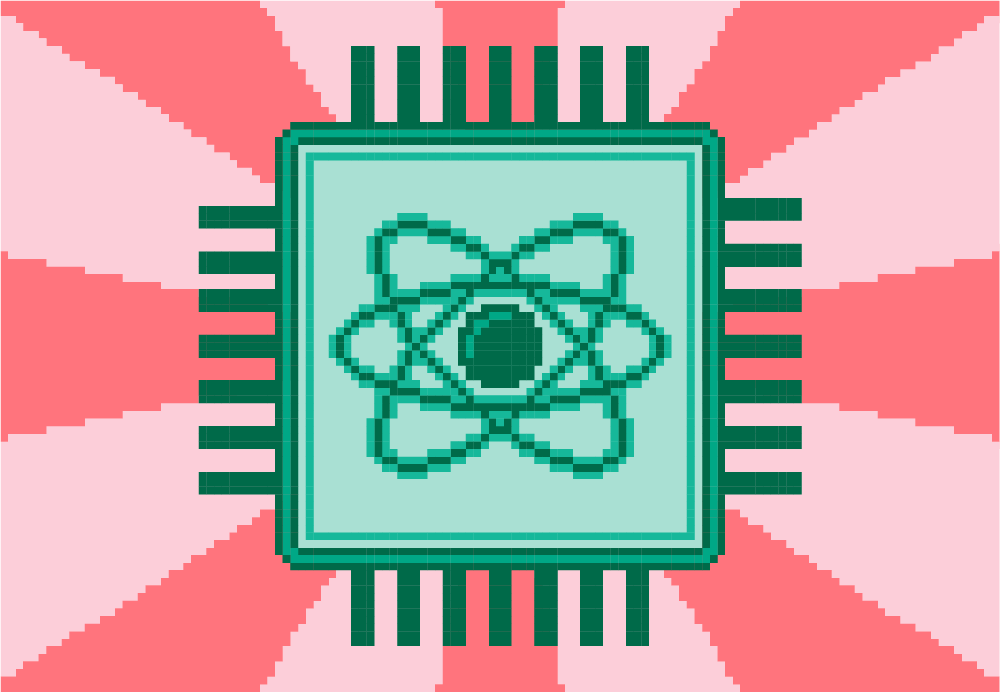

Производња квантних рачунара
============================

Квантни рачунар може да се направи на више начина. Међу технологијама које се истражују су и: 
- заробљени јони `(trapped ions) <https://en.wikipedia.org/wiki/Trapped_ion_quantum_computer>`_, 
- силицијумске квантне тачке `(silicon quantum dots) <https://en.wikipedia.org/wiki/Quantum_dot>`_, 
- тополошки квантни рачунар `(topological quantum computer) <https://en.wikipedia.org/wiki/Topological_quantum_computer>`_,
- интегрисана квантна фотоника `(Integrated quantum photonics) <https://en.wikipedia.org/wiki/Integrated_quantum_photonics>`_ 
 
Сви ови приступи имају неке предности и мане. Тренутно су најзаступљенији 
рачунари који су засновани на логичким елементима који користе суперпроводљива електронска кола. Они раде 
на сличан начин као класични рачунари и надовезују се на постојећу индустрију полупроводника. Главни 
изазов у градњи оваквих квантних рачунара је повећање тренутно малог броја кубита који је данас могућ, 
јер је тешко да се кубити одрже у њиховом квантном стању (најмоћнији до сада направљени квантни рачунари 
користе троцифрен број кубита). Кубити функционишу кохерентно једино када се охладе на само хиљадити део 
степена изнад апсолутне нуле, што их такође штити од дестабилизујућих ефеката зрачења, светлости, звука, 
вибрација и магнетних поља. 

    
.. comment 

    Тек када буде могуће повећати број кубита (ово није једини услов), биће могуће да се граде довољно моћни
    квантни рачунари да покрећу квантне алгоритме као што је Шоров алгоритам за "дешифровање". 
    До тада, фокус је на развоју смислених алгоритама за данашњу Noisy intermediate-scale quantum (NISQ) 
    технологију.

Рачунари засновани на квантном каљењу (енгл. *quantum annealing*) имају радикално другачији приступ. При квантном 
каљењу, покрећу се алгоритми адијабатског квантног рачунања. Уместо да дозвољавају спрезање свих кубита, 
ови процеси стварају окружење у којем су могуће само ограничене, локалне везе неких кубита. 
Овакав приступ је, између осталог, већ коришћен за решавање проблема у домену финансија и ваздухопловне 
индустрије. Као и код квантног рачунарства заснованог на логичким колима, декохеренција је велики изазов 
за рачунаре засноване на квантном каљењу и они такође захтевају огромне расхладне јединице. Могућности 
рачунара заснованих на квантном каљењу су још увек веома ограничене, а цена висока. 
